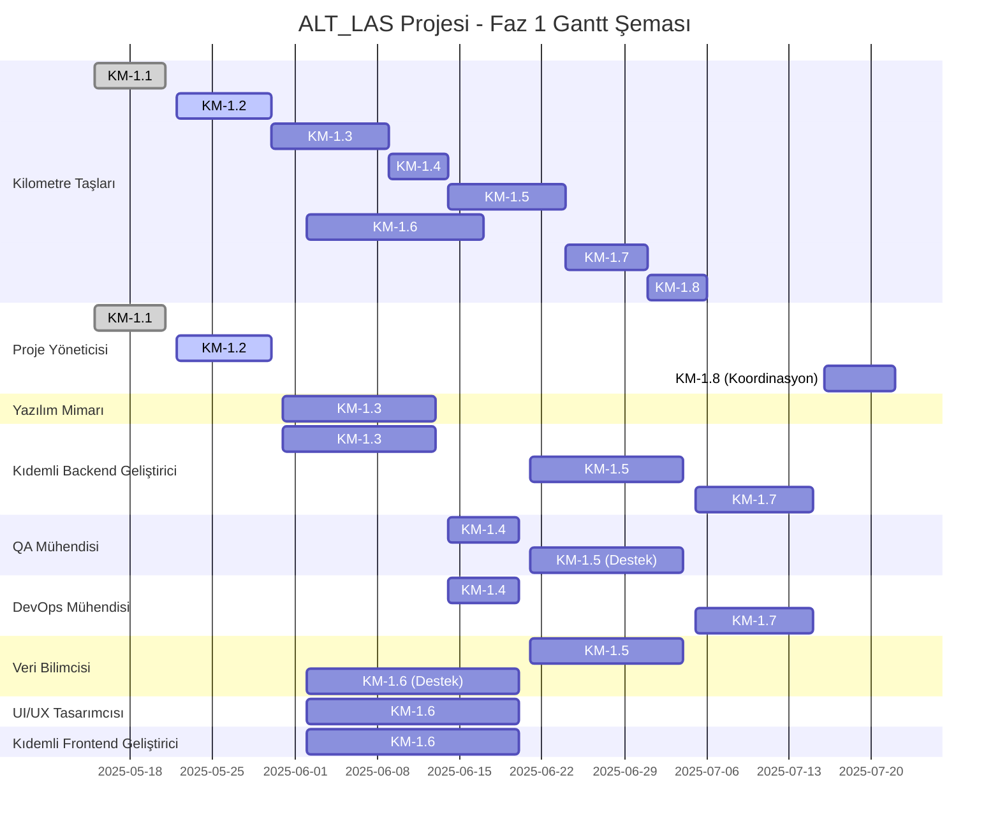

# ALT_LAS Projesi - Detaylı Faz 1 Planı ve Risk Matrisi

**Doküman Bilgileri:**
- **Oluşturan:** Proje Yöneticisi (AI)
- **Oluşturma Tarihi:** 2025-05-22
- **Son Güncelleme:** 2025-05-22
- **Durum:** Taslak
- **İlgili Görev:** KM-1.2 (Detaylı Faz 1 Planı ve Risk Matrisi)
- **Öncelik:** P1

## 1. Giriş

Bu belge, ALT_LAS projesinin Faz 1 (Temel Kurulum, Analiz ve Yüksek Öncelikli Entegrasyonlar) için detaylı planı, kaynak atamaları ve güncellenmiş risk matrisini içermektedir. Bu plan, KM-1.1 (Bilgi Paylaşım Mekanizması) tamamlandıktan sonra, tüm personaların ilk analizleri dikkate alınarak oluşturulmuştur.

## 2. Faz 1 Kilometre Taşları ve Görevler

Faz 1, aşağıdaki kilometre taşlarını ve görevleri içermektedir:

### KM-1.1: Bilgi Paylaşım Mekanizması Aktif (Tamamlandı)
- **Durum:** Tamamlandı
- **Sorumlu:** Proje Yöneticisi (AI)
- **Başlangıç-Bitiş:** 2025-05-15 - 2025-05-21
- **Gerçekleşen Efor:** 5 gün
- **Çıktılar:** Ekip içi bilgi paylaşım mekanizması aktif ve işler durumda.

### KM-1.2: Detaylı Faz 1 Planı ve Risk Matrisi (Bu Belge)
- **Durum:** Devam Ediyor
- **Sorumlu:** Proje Yöneticisi (AI)
- **Başlangıç-Bitiş:** 2025-05-22 - 2025-05-30
- **Tahmini Efor:** 7 gün
- **Çıktılar:** Detaylı Faz 1 planı, kaynak atamaları ve güncellenmiş risk matrisi.

### KM-1.3: API Meta Veri Tasarımı (GPU)
- **Durum:** Planlandı
- **Sorumlu:** Yazılım Mimarı, Kıdemli Backend Geliştirici
- **Başlangıç-Bitiş:** 2025-05-31 - 2025-06-13
- **Tahmini Efor:** 10 gün
- **Bağımlılıklar:** KM-1.2
- **Çıktılar:** API yanıtlarında işlem süresi/GPU kaynağı meta verisi için mimari tasarım ve örnek implementasyon.

#### Alt Görevler:
1. **API Meta Veri Gereksinimleri Analizi**
   - **Sorumlu:** Yazılım Mimarı
   - **Süre:** 2 gün
   - **Çıktı:** Gereksinim dokümanı

2. **Meta Veri Şema Tasarımı**
   - **Sorumlu:** Yazılım Mimarı
   - **Süre:** 3 gün
   - **Çıktı:** JSON şema dokümanı

3. **Örnek Implementasyon Geliştirme**
   - **Sorumlu:** Kıdemli Backend Geliştirici
   - **Süre:** 4 gün
   - **Çıktı:** Çalışan kod örneği

4. **Dokümantasyon ve Entegrasyon Kılavuzu**
   - **Sorumlu:** Yazılım Mimarı, Kıdemli Backend Geliştirici
   - **Süre:** 1 gün
   - **Çıktı:** Teknik dokümantasyon

### KM-1.4: Performans Test Planı Güncelleme
- **Durum:** Planlandı
- **Sorumlu:** QA Mühendisi, DevOps Mühendisi
- **Başlangıç-Bitiş:** 2025-06-14 - 2025-06-20
- **Tahmini Efor:** 5 gün
- **Bağımlılıklar:** KM-1.3
- **Çıktılar:** 95. ve 99. persentil yanıt süreleri ölçümü için performans test planı ve izleme altyapısı entegrasyonu.

#### Alt Görevler:
1. **Mevcut Test Planı Analizi**
   - **Sorumlu:** QA Mühendisi
   - **Süre:** 1 gün
   - **Çıktı:** Analiz raporu

2. **Persentil Ölçüm Metodolojisi Geliştirme**
   - **Sorumlu:** QA Mühendisi
   - **Süre:** 2 gün
   - **Çıktı:** Metodoloji dokümanı

3. **İzleme Altyapısı Entegrasyonu**
   - **Sorumlu:** DevOps Mühendisi
   - **Süre:** 2 gün
   - **Çıktı:** Entegrasyon kodu ve dokümanı

### KM-1.5: GPU Ön Isıtma PoC (ai-orchestrator)
- **Durum:** Planlandı
- **Sorumlu:** Kıdemli Backend Geliştirici, Veri Bilimcisi
- **Başlangıç-Bitiş:** 2025-06-21 - 2025-07-04
- **Tahmini Efor:** 10 gün
- **Bağımlılıklar:** KM-1.4
- **Çıktılar:** GPU ön ısıtma ve önbellekleme mekanizması için PoC ve performans test sonuçları.

#### Alt Görevler:
1. **Mevcut ai-orchestrator Analizi**
   - **Sorumlu:** Kıdemli Backend Geliştirici
   - **Süre:** 2 gün
   - **Çıktı:** Analiz raporu

2. **GPU Ön Isıtma Stratejileri Araştırması**
   - **Sorumlu:** Veri Bilimcisi
   - **Süre:** 2 gün
   - **Çıktı:** Araştırma raporu

3. **PoC Geliştirme**
   - **Sorumlu:** Kıdemli Backend Geliştirici, Veri Bilimcisi
   - **Süre:** 4 gün
   - **Çıktı:** Çalışan PoC kodu

4. **Performans Testleri ve Analiz**
   - **Sorumlu:** Kıdemli Backend Geliştirici, QA Mühendisi
   - **Süre:** 2 gün
   - **Çıktı:** Test sonuçları ve analiz raporu

### KM-1.6: Dinamik UI/UX Prototip ve Bileşenler
- **Durum:** Planlandı
- **Sorumlu:** UI/UX Tasarımcısı, Kıdemli Frontend Geliştirici, Veri Bilimcisi (destek)
- **Başlangıç-Bitiş:** 2025-06-02 - 2025-06-20
- **Tahmini Efor:** 15 gün
- **Bağımlılıklar:** KM-1.2
- **Çıktılar:** Dinamik, filtrelenebilir arayüzler için UI/UX prototipleri ve geliştirilmiş arayüz bileşenleri.

#### Alt Görevler:
1. **Kullanıcı İhtiyaçları Analizi**
   - **Sorumlu:** UI/UX Tasarımcısı
   - **Süre:** 3 gün
   - **Çıktı:** Kullanıcı ihtiyaçları raporu

2. **Arayüz Tasarımı ve Wireframe'ler**
   - **Sorumlu:** UI/UX Tasarımcısı
   - **Süre:** 4 gün
   - **Çıktı:** Wireframe'ler ve tasarım dokümanı

3. **Prototip Geliştirme**
   - **Sorumlu:** Kıdemli Frontend Geliştirici
   - **Süre:** 6 gün
   - **Çıktı:** Çalışan prototip

4. **Veri Görselleştirme Bileşenleri**
   - **Sorumlu:** Kıdemli Frontend Geliştirici, Veri Bilimcisi
   - **Süre:** 2 gün
   - **Çıktı:** Veri görselleştirme bileşenleri

### KM-1.7: Nsight İzleme Altyapısı Kurulumu
- **Durum:** Planlandı
- **Sorumlu:** DevOps Mühendisi, Kıdemli Backend Geliştirici
- **Başlangıç-Bitiş:** 2025-07-05 - 2025-07-15
- **Tahmini Efor:** 7 gün
- **Bağımlılıklar:** KM-1.5
- **Çıktılar:** Nsight ile detaylı çekirdek izleme altyapısı ve örnek raporlar.

#### Alt Görevler:
1. **Nsight Kurulum ve Konfigürasyon**
   - **Sorumlu:** DevOps Mühendisi
   - **Süre:** 2 gün
   - **Çıktı:** Kurulum dokümanı

2. **İzleme Altyapısı Entegrasyonu**
   - **Sorumlu:** DevOps Mühendisi, Kıdemli Backend Geliştirici
   - **Süre:** 3 gün
   - **Çıktı:** Entegrasyon kodu ve dokümanı

3. **Örnek Raporlar ve Analiz**
   - **Sorumlu:** Kıdemli Backend Geliştirici
   - **Süre:** 2 gün
   - **Çıktı:** Örnek raporlar ve analiz dokümanı

### KM-1.8: Faz 1 Persona Görevleri Tamamlanması
- **Durum:** Planlandı
- **Sorumlu:** Tüm Personalar (Proje Yöneticisi koordinasyonunda)
- **Başlangıç-Bitiş:** 2025-07-16 - 2025-07-22
- **Tahmini Efor:** 5 gün
- **Bağımlılıklar:** KM-1.1, KM-1.2, KM-1.3, KM-1.4, KM-1.5, KM-1.6, KM-1.7
- **Çıktılar:** Tüm personaların Faz 1 ilk görevlerinin tamamlanması ve raporlanması.

## 3. Kaynak Atamaları

Faz 1 için kaynak atamaları aşağıdaki gibidir:

| Persona                      | Kilometre Taşları                                | Toplam Efor (gün) | Dönem                      |
|------------------------------|--------------------------------------------------|-------------------|----------------------------|
| Proje Yöneticisi (AI)        | KM-1.1, KM-1.2, KM-1.8 (koordinasyon)            | 12 + 5 (koord.)   | 2025-05-15 - 2025-07-22    |
| Yazılım Mimarı               | KM-1.3                                           | 6                 | 2025-05-31 - 2025-06-13    |
| Kıdemli Backend Geliştirici  | KM-1.3, KM-1.5, KM-1.7                           | 13                | 2025-05-31 - 2025-07-15    |
| QA Mühendisi                 | KM-1.4, KM-1.5 (destek)                          | 5                 | 2025-06-14 - 2025-07-04    |
| DevOps Mühendisi             | KM-1.4, KM-1.7                                   | 7                 | 2025-06-14 - 2025-07-15    |
| Veri Bilimcisi               | KM-1.5, KM-1.6 (destek)                          | 8                 | 2025-06-02 - 2025-07-04    |
| UI/UX Tasarımcısı            | KM-1.6                                           | 7                 | 2025-06-02 - 2025-06-20    |
| Kıdemli Frontend Geliştirici | KM-1.6                                           | 8                 | 2025-06-02 - 2025-06-20    |

## 4. Güncellenmiş Risk Matrisi

Faz 1 için güncellenmiş risk matrisi aşağıdaki gibidir:

| Risk ID | Risk Açıklaması                                                                 | Kategori        | Olasılık (1-5) | Etki (1-5) | Risk Seviyesi (1-25) | Önleyici Faaliyetler                                                                                                                               | Sorumlu Persona(lar)                               | Durum      |
|---------|---------------------------------------------------------------------------------|-----------------|----------------|------------|----------------------|----------------------------------------------------------------------------------------------------------------------------------------------------|----------------------------------------------------|------------|
| R001    | CUDA Toolkit ve NVIDIA sürücü versiyonları arasında uyumsuzluk sorunları.         | Teknik          | 3              | 4          | 12 (Yüksek)          | Standart geliştirme ve test ortamları (Docker) oluşturmak. Sürücü ve toolkit versiyonlarını dikkatlice seçmek ve test etmek. Detaylı dokümantasyon. | DevOps Mühendisi, QA Mühendisi                     | İzleniyor  |
| R002    | Beklenen performans kazanımlarının CUDA entegrasyonu ile elde edilememesi.        | Teknik/Performans | 3              | 4          | 12 (Yüksek)          | Kapsamlı hotspot analizi. PoC çalışmaları. Nsight gibi araçlarla detaylı profilleyerek optimizasyon. Gerçekçi beklentiler belirlemek.             | Kıdemli Backend Gel., Veri Bilimcisi, Yazılım Mimarı | İzleniyor  |
| R003    | Farklı GPU mimarilerinde (örn. geliştirme vs. üretim) tutarsız davranışlar.       | Teknik/Uyum     | 2              | 4          | 8 (Orta)             | Farklı GPU mimarileri için uyumluluk test matrisi oluşturmak (S5.1). Üretim ortamına benzer test ortamları.                                       | DevOps Mühendisi, QA Mühendisi                     | İzleniyor  |
| R004    | Proje personelinin CUDA ve ilgili teknolojilerdeki uzmanlık eksikliği.           | Kaynak/Yetkinlik| 2              | 3          | 6 (Orta)             | Eğitim ve bilgi paylaşım oturumları (S8.2). Detaylı dokümantasyon. Persona gelişim kayıtlarının takibi. Mentorluk.                               | Proje Yöneticisi, Tüm Personalar                   | Azaltıldı  |
| R005    | Görevler arası bağımlılıkların yanlış yönetilmesi sonucu gecikmeler.              | Planlama        | 2              | 3          | 6 (Orta)             | Detaylı bağımlılık analizi (`project_milestones_dependencies_critical_path.md`). Düzenli ilerleme toplantıları. Kritik yol takibi.                  | Proje Yöneticisi                                   | Azaltıldı  |
| R006    | Proje kapsamının kontrolsüz bir şekilde genişlemesi (Scope Creep).                | Planlama        | 2              | 4          | 8 (Orta)             | Net tanımlanmış görevler ve kilometre taşları. Değişiklik yönetim süreci. Düzenli kapsam gözden geçirmeleri.                                     | Proje Yöneticisi, Yazılım Mimarı                   | İzleniyor  |
| R007    | İletişim eksiklikleri veya yanlış anlaşılmalar nedeniyle koordinasyon sorunları.    | İletişim        | 2              | 3          | 6 (Orta)             | Düzenli toplantılar. Net raporlama standartları. Merkezi görev panosu. `ofis_durumu.md` gibi araçlarla şeffaflık.                              | Proje Yöneticisi                                   | Azaltıldı  |
| R008    | Üçüncü parti kütüphane ve araçlarda lisans uyumsuzlukları veya kısıtlamaları.     | Hukuki/Teknik   | 2              | 5          | 10 (Orta)            | Kullanılacak tüm kütüphane ve araçların lisanslarının projenin ticari hedefleriyle uyumluluğunun önceden detaylı incelenmesi.                     | Proje Yöneticisi, Yazılım Mimarı                   | İzleniyor  |
| R009    | Veri güvenliği ve gizliliği ile ilgili sorunların CUDA iş akışlarında ortaya çıkması.| Güvenlik        | 2              | 4          | 8 (Orta)             | Güvenlik standartlarına uygun kodlama pratikleri. Veri transferi ve saklama süreçlerinde güvenlik önlemleri.                                     | Yazılım Mimarı, DevOps Mühendisi                   | İzleniyor  |
| R010    | Yönetici Ofisi ve diğer planlama dokümanlarının güncel tutulmaması.               | Yönetim         | 2              | 3          | 6 (Orta)             | Proje Yöneticisi (AI) tarafından düzenli güncelleme sorumluluğu. Diğer personaların da katkıda bulunması için teşvik.                            | Proje Yöneticisi                                   | Azaltıldı  |
| R011    | GPU kaynaklarının (geliştirme/test/üretim) yetersiz kalması veya erişim sorunları. | Kaynak/Altyapı  | 2              | 5          | 10 (Orta)            | İhtiyaçların erken tespiti. DevOps Mühendisi ile koordineli kaynak planlaması. Kubernetes gibi orkestrasyon araçlarıyla verimli kaynak kullanımı. | Proje Yöneticisi, DevOps Mühendisi                   | İzleniyor  |
| R012    | GPU Ön Isıtma PoC'sinin (KM-1.5) beklenen performans iyileştirmesini sağlayamaması. | Teknik/Performans | 3              | 3          | 9 (Orta)             | Alternatif yaklaşımların araştırılması. Farklı önbellekleme stratejilerinin denenmesi. Gerçekçi beklentiler belirlenmesi.                        | Kıdemli Backend Gel., Veri Bilimcisi                | Yeni       |
| R013    | Nsight izleme altyapısının (KM-1.7) üretim ortamında performans etkisi yaratması.  | Teknik/Performans | 2              | 4          | 8 (Orta)             | İzleme seviyelerinin yapılandırılabilir olması. Üretim ve geliştirme ortamları için farklı izleme stratejileri.                                  | DevOps Mühendisi, Kıdemli Backend Gel.              | Yeni       |

### Risk Değişiklikleri:

1. **Azaltılan Riskler:**
   - R004: Bilgi paylaşım mekanizmasının (KM-1.1) başarıyla tamamlanması ile azaltıldı.
   - R005: Detaylı bağımlılık analizi ve bu belgedeki detaylı plan ile azaltıldı.
   - R007: Bilgi paylaşım mekanizmasının (KM-1.1) başarıyla tamamlanması ile azaltıldı.
   - R010: Düzenli dokümantasyon güncellemeleri ile azaltıldı.

2. **Yeni Riskler:**
   - R012: GPU Ön Isıtma PoC'si ile ilgili yeni risk eklendi.
   - R013: Nsight izleme altyapısı ile ilgili yeni risk eklendi.

## 5. Gantt Şeması

## 6. Sonuç ve Öneriler

Faz 1 planı, ALT_LAS projesinin CUDA entegrasyonu için temel kurulum, analiz ve yüksek öncelikli entegrasyonları içermektedir. Bu plan, KM-1.1 (Bilgi Paylaşım Mekanizması) tamamlandıktan sonra, tüm personaların ilk analizleri dikkate alınarak oluşturulmuştur.

### Öneriler:

1. **Düzenli İlerleme Toplantıları:** Haftalık ilerleme toplantıları düzenlenerek, görevlerin durumu ve risklerin değerlendirilmesi yapılmalıdır.
2. **Esnek Planlama:** Görevler arası bağımlılıklar ve potansiyel riskler dikkate alınarak, planın esnek bir şekilde uygulanması önerilmektedir.
3. **Dokümantasyon Odaklı Yaklaşım:** Tüm görevlerin çıktıları detaylı olarak dokümante edilmeli ve bilgi paylaşım mekanizması üzerinden paylaşılmalıdır.
4. **Erken Test ve Doğrulama:** Özellikle GPU ön ısıtma PoC'si (KM-1.5) gibi kritik görevlerde, erken test ve doğrulama yapılarak potansiyel sorunlar önceden tespit edilmelidir.

Bu plan, projenin dinamik yapısına uygun olarak periyodik olarak gözden geçirilecek ve güncellenecektir.
