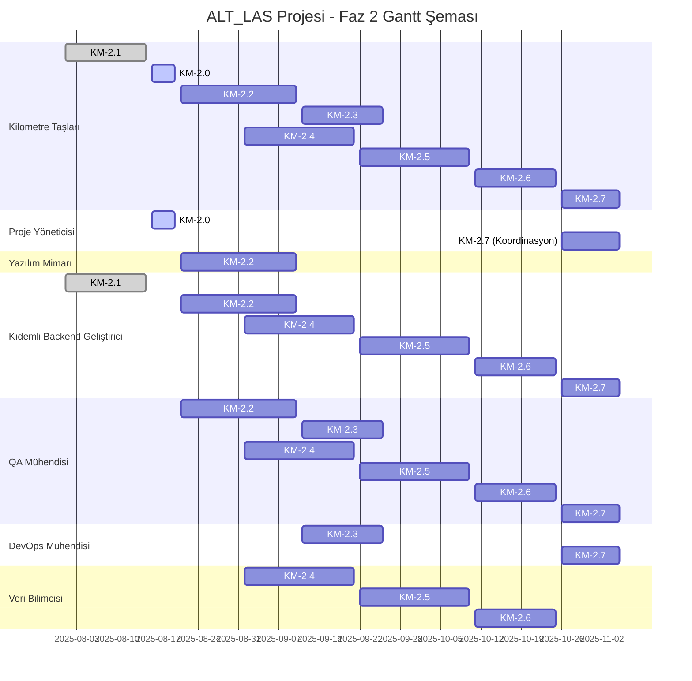

# ALT_LAS Projesi - Detaylı Faz 2 Planı

**Doküman Bilgileri:**
- **Oluşturan:** Proje Yöneticisi (AI)
- **Oluşturma Tarihi:** 2025-08-16
- **Son Güncelleme:** 2025-08-16
- **Durum:** Taslak
- **İlgili Görev:** KM-2.0 (Detaylı Faz 2 Planı)
- **Öncelik:** P1

## 1. Giriş

Bu belge, ALT_LAS projesinin Faz 2 (Geliştirme, Derinlemesine Optimizasyon ve Kapsamlı Test) için detaylı planı, kaynak atamaları ve kilometre taşlarını içermektedir. Faz 1'in başarıyla tamamlanmasının ardından, Faz 2'de daha derin teknik entegrasyonlar ve optimizasyonlar gerçekleştirilecektir.

## 2. Faz 2 Kilometre Taşları ve Görevler

Faz 2, aşağıdaki kilometre taşlarını ve görevleri içermektedir:

### KM-2.0: Detaylı Faz 2 Planı (Bu Belge)
- **Durum:** Devam Ediyor
- **Sorumlu:** Proje Yöneticisi (AI)
- **Başlangıç-Bitiş:** 2025-08-16 - 2025-08-20
- **Tahmini Efor:** 5 gün
- **Bağımlılıklar:** KM-1.8 (Faz 1 Persona Görevleri Tamamlanması)
- **Çıktılar:** Detaylı Faz 2 planı, kaynak atamaları ve güncellenmiş risk matrisi.

### KM-2.1: Çoklu GPU Desteği
- **Durum:** Tamamlandı
- **Sorumlu:** Kıdemli Backend Geliştirici
- **Başlangıç-Bitiş:** 2025-08-01 - 2025-08-15
- **Gerçekleşen Efor:** 15 gün
- **Çıktılar:** Çoklu GPU desteği ile ölçeklenebilirlik sağlanmış.

### KM-2.2: GPU İstek Yönlendirme Katmanı
- **Durum:** Planlandı
- **Sorumlu:** Yazılım Mimarı, Kıdemli Backend Geliştirici
- **Başlangıç-Bitiş:** 2025-08-21 - 2025-09-10
- **Tahmini Efor:** 15 gün
- **Bağımlılıklar:** KM-2.0, KM-2.1
- **Çıktılar:** GPU İstek Yönlendirme Katmanı geliştirilmiş ve test edilmiş.

#### Alt Görevler:
1. **Mevcut İstek Yönlendirme Mekanizması Analizi**
   - **Sorumlu:** Yazılım Mimarı
   - **Süre:** 3 gün
   - **Çıktı:** Analiz raporu

2. **GPU Yönlendirme Stratejisi Tasarımı**
   - **Sorumlu:** Yazılım Mimarı, Kıdemli Backend Geliştirici
   - **Süre:** 4 gün
   - **Çıktı:** Tasarım dokümanı

3. **Yönlendirme Katmanı Geliştirme**
   - **Sorumlu:** Kıdemli Backend Geliştirici
   - **Süre:** 6 gün
   - **Çıktı:** Çalışan kod

4. **Test ve Optimizasyon**
   - **Sorumlu:** Kıdemli Backend Geliştirici, QA Mühendisi
   - **Süre:** 2 gün
   - **Çıktı:** Test sonuçları ve optimizasyon raporu

### KM-2.3: Farklı GPU Mimarileri için Uyumluluk Test Matrisi
- **Durum:** Planlandı
- **Sorumlu:** QA Mühendisi, DevOps Mühendisi
- **Başlangıç-Bitiş:** 2025-09-11 - 2025-09-25
- **Tahmini Efor:** 10 gün
- **Bağımlılıklar:** KM-2.2
- **Çıktılar:** Farklı GPU mimarileri için uyumluluk test matrisi oluşturulmuş ve test otomasyonu sağlanmış.

#### Alt Görevler:
1. **GPU Mimarileri Analizi**
   - **Sorumlu:** DevOps Mühendisi
   - **Süre:** 2 gün
   - **Çıktı:** GPU mimarileri analiz raporu

2. **Test Matrisi Oluşturma**
   - **Sorumlu:** QA Mühendisi
   - **Süre:** 3 gün
   - **Çıktı:** Test matrisi dokümanı

3. **Test Otomasyonu Geliştirme**
   - **Sorumlu:** QA Mühendisi, DevOps Mühendisi
   - **Süre:** 4 gün
   - **Çıktı:** Test otomasyon kodları

4. **Test Koşumu ve Raporlama**
   - **Sorumlu:** QA Mühendisi
   - **Süre:** 1 gün
   - **Çıktı:** Test sonuçları ve rapor

### KM-2.4: TensorRT için Farklı Nicemleme Stratejileri
- **Durum:** Planlandı
- **Sorumlu:** Veri Bilimcisi, Kıdemli Backend Geliştirici
- **Başlangıç-Bitiş:** 2025-09-01 - 2025-09-20
- **Tahmini Efor:** 15 gün
- **Bağımlılıklar:** KM-2.0
- **Çıktılar:** TensorRT için farklı nicemleme stratejileri denenmiş, analiz raporu ve optimize edilmiş modeller sunulmuş.

#### Alt Görevler:
1. **Mevcut Model Performans Analizi**
   - **Sorumlu:** Veri Bilimcisi
   - **Süre:** 3 gün
   - **Çıktı:** Performans analiz raporu

2. **Nicemleme Stratejileri Araştırması**
   - **Sorumlu:** Veri Bilimcisi
   - **Süre:** 4 gün
   - **Çıktı:** Araştırma raporu

3. **Farklı Nicemleme Stratejilerinin Uygulanması**
   - **Sorumlu:** Veri Bilimcisi, Kıdemli Backend Geliştirici
   - **Süre:** 5 gün
   - **Çıktı:** Optimize edilmiş modeller

4. **Karşılaştırmalı Performans Testleri**
   - **Sorumlu:** Veri Bilimcisi, QA Mühendisi
   - **Süre:** 3 gün
   - **Çıktı:** Test sonuçları ve karşılaştırma raporu

### KM-2.5: segmentation-service için C++ CUDA Çekirdeği PoC
- **Durum:** Planlandı
- **Sorumlu:** Kıdemli Backend Geliştirici, Veri Bilimcisi
- **Başlangıç-Bitiş:** 2025-09-21 - 2025-10-10
- **Tahmini Efor:** 15 gün
- **Bağımlılıklar:** KM-2.0
- **Çıktılar:** segmentation-service için C++ CUDA çekirdeği ile karşılaştırmalı PoC tamamlanmış ve raporlanmış.

#### Alt Görevler:
1. **Mevcut segmentation-service Analizi**
   - **Sorumlu:** Kıdemli Backend Geliştirici
   - **Süre:** 3 gün
   - **Çıktı:** Analiz raporu

2. **C++ CUDA Çekirdeği Tasarımı**
   - **Sorumlu:** Kıdemli Backend Geliştirici, Veri Bilimcisi
   - **Süre:** 4 gün
   - **Çıktı:** Tasarım dokümanı

3. **PoC Geliştirme**
   - **Sorumlu:** Kıdemli Backend Geliştirici
   - **Süre:** 6 gün
   - **Çıktı:** Çalışan PoC kodu

4. **Karşılaştırmalı Performans Testleri**
   - **Sorumlu:** Kıdemli Backend Geliştirici, QA Mühendisi
   - **Süre:** 2 gün
   - **Çıktı:** Test sonuçları ve karşılaştırma raporu

### KM-2.6: segmentation-service NLP Görevlerinde cuDF Entegrasyonu
- **Durum:** Planlandı
- **Sorumlu:** Veri Bilimcisi, Kıdemli Backend Geliştirici
- **Başlangıç-Bitiş:** 2025-10-11 - 2025-10-25
- **Tahmini Efor:** 12 gün
- **Bağımlılıklar:** KM-2.5
- **Çıktılar:** segmentation-service NLP görevlerinde cuDF ile veri ön işleme entegrasyonu tamamlanmış ve performans iyileştirmesi raporlanmış.

#### Alt Görevler:
1. **NLP Veri Ön İşleme Analizi**
   - **Sorumlu:** Veri Bilimcisi
   - **Süre:** 3 gün
   - **Çıktı:** Analiz raporu

2. **cuDF Entegrasyon Stratejisi**
   - **Sorumlu:** Veri Bilimcisi, Kıdemli Backend Geliştirici
   - **Süre:** 2 gün
   - **Çıktı:** Entegrasyon stratejisi dokümanı

3. **Entegrasyon Geliştirme**
   - **Sorumlu:** Kıdemli Backend Geliştirici
   - **Süre:** 5 gün
   - **Çıktı:** Entegrasyon kodu

4. **Performans Testleri ve Analiz**
   - **Sorumlu:** Veri Bilimcisi, QA Mühendisi
   - **Süre:** 2 gün
   - **Çıktı:** Test sonuçları ve analiz raporu

### KM-2.7: Faz 2 Entegrasyon Testleri ve Performans Değerlendirmesi
- **Durum:** Planlandı
- **Sorumlu:** QA Mühendisi, DevOps Mühendisi, Kıdemli Backend Geliştirici
- **Başlangıç-Bitiş:** 2025-10-26 - 2025-11-05
- **Tahmini Efor:** 8 gün
- **Bağımlılıklar:** KM-2.2, KM-2.3, KM-2.4, KM-2.5, KM-2.6
- **Çıktılar:** Faz 2 entegrasyon testleri tamamlanmış ve performans değerlendirme raporu hazırlanmış.

#### Alt Görevler:
1. **Entegrasyon Test Planı Hazırlama**
   - **Sorumlu:** QA Mühendisi
   - **Süre:** 2 gün
   - **Çıktı:** Test planı dokümanı

2. **Entegrasyon Testleri Koşumu**
   - **Sorumlu:** QA Mühendisi, DevOps Mühendisi
   - **Süre:** 3 gün
   - **Çıktı:** Test sonuçları

3. **Performans Değerlendirmesi**
   - **Sorumlu:** QA Mühendisi, Kıdemli Backend Geliştirici
   - **Süre:** 3 gün
   - **Çıktı:** Performans değerlendirme raporu

## 3. Kaynak Atamaları

Faz 2 için kaynak atamaları aşağıdaki gibidir:

| Persona                      | Kilometre Taşları                                | Toplam Efor (gün) | Dönem                      |
|------------------------------|--------------------------------------------------|-------------------|----------------------------|
| Proje Yöneticisi (AI)        | KM-2.0, KM-2.7 (koordinasyon)                    | 5 + 3 (koord.)    | 2025-08-16 - 2025-11-05    |
| Yazılım Mimarı               | KM-2.2                                           | 7                 | 2025-08-21 - 2025-09-10    |
| Kıdemli Backend Geliştirici  | KM-2.1, KM-2.2, KM-2.4, KM-2.5, KM-2.6, KM-2.7   | 43                | 2025-08-01 - 2025-11-05    |
| QA Mühendisi                 | KM-2.2, KM-2.3, KM-2.4, KM-2.5, KM-2.6, KM-2.7   | 13                | 2025-08-21 - 2025-11-05    |
| DevOps Mühendisi             | KM-2.3, KM-2.7                                   | 7                 | 2025-09-11 - 2025-11-05    |
| Veri Bilimcisi               | KM-2.4, KM-2.5, KM-2.6                           | 20                | 2025-09-01 - 2025-10-25    |

## 4. Gantt Şeması

## 5. Sonuç ve Öneriler

Faz 2 planı, ALT_LAS projesinin CUDA entegrasyonu için geliştirme, derinlemesine optimizasyon ve kapsamlı test aşamalarını içermektedir. Bu plan, Faz 1'in başarıyla tamamlanmasının ardından, daha derin teknik entegrasyonlar ve optimizasyonlar gerçekleştirmek üzere hazırlanmıştır.

### Öneriler:

1. **Düzenli İlerleme Toplantıları:** Haftalık ilerleme toplantıları düzenlenerek, görevlerin durumu ve risklerin değerlendirilmesi yapılmalıdır.
2. **Paralel Geliştirme Stratejisi:** KM-2.2 (GPU İstek Yönlendirme Katmanı) ve KM-2.4 (TensorRT Nicemleme Stratejileri) gibi birbirine bağımlı olmayan görevler paralel olarak yürütülerek zaman kazanılabilir.
3. **Erken Test ve Doğrulama:** Özellikle KM-2.5 (C++ CUDA Çekirdeği PoC) gibi kritik görevlerde, erken test ve doğrulama yapılarak potansiyel sorunlar önceden tespit edilmelidir.
4. **Dokümantasyon Odaklı Yaklaşım:** Tüm görevlerin çıktıları detaylı olarak dokümante edilmeli ve bilgi paylaşım mekanizması üzerinden paylaşılmalıdır.

Bu plan, projenin dinamik yapısına uygun olarak periyodik olarak gözden geçirilecek ve güncellenecektir.
