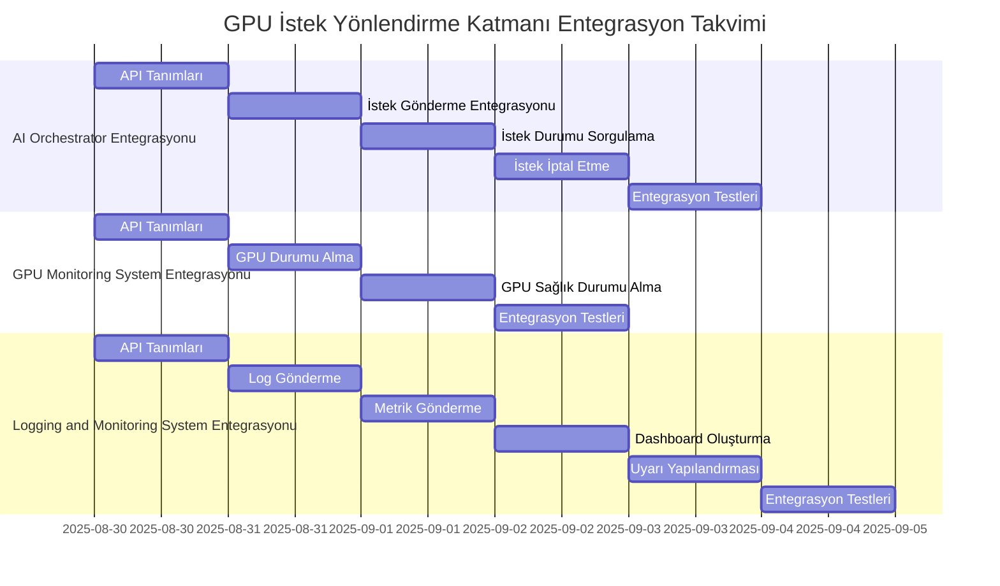

# GPU İstek Yönlendirme Katmanı Entegrasyon Planı

**Doküman Bilgileri:**
- **Oluşturan:** Yazılım Mimarı, Kıdemli Backend Geliştirici
- **Oluşturma Tarihi:** 2025-08-22
- **Son Güncelleme:** 2025-08-22
- **Durum:** Taslak
- **İlgili Görev:** KM-2.2 (GPU İstek Yönlendirme Katmanı)
- **Öncelik:** P1

## 1. Giriş

Bu belge, GPU İstek Yönlendirme Katmanı'nın mevcut sistemlerle entegrasyonu için planı içermektedir. Bu entegrasyon planı, GPU İstek Yönlendirme Katmanı'nın AI Orchestrator, GPU Monitoring System ve Logging and Monitoring System gibi mevcut sistemlerle nasıl entegre edileceğini detaylandırmaktadır.

## 2. Entegrasyon Noktaları

### 2.1 AI Orchestrator Entegrasyonu

AI Orchestrator, GPU İstek Yönlendirme Katmanı ile aşağıdaki noktalarda entegre olacaktır:

#### 2.1.1 İstek Gönderme

AI Orchestrator, işlem isteklerini GPU İstek Yönlendirme Katmanı'na gönderecektir. Bu entegrasyon, aşağıdaki adımları içerir:

1. AI Orchestrator, `/api/v1/route` endpoint'ine POST isteği gönderir.
2. İstek gövdesi, model_id, priority, type, resource_requirements gibi parametreleri içerir.
3. GPU İstek Yönlendirme Katmanı, isteği alır, işler ve yanıt döndürür.
4. AI Orchestrator, yanıtı alır ve istek durumunu takip etmek için request_id'yi saklar.

```python
# AI Orchestrator tarafında entegrasyon kodu
async def route_request(request_data):
    """
    İsteği GPU İstek Yönlendirme Katmanı'na yönlendir.
    
    Args:
        request_data: İstek verileri
        
    Returns:
        Yönlendirme sonucu
    """
    async with aiohttp.ClientSession() as session:
        async with session.post(
            f"{config['gpu_router_url']}/api/v1/route",
            json=request_data
        ) as response:
            if response.status == 200:
                return await response.json()
            else:
                logger.error(f"İstek yönlendirme başarısız: {response.status}")
                raise Exception(f"İstek yönlendirme başarısız: {response.status}")
```

#### 2.1.2 İstek Durumu Sorgulama

AI Orchestrator, işlem isteklerinin durumunu GPU İstek Yönlendirme Katmanı'ndan sorgulayacaktır. Bu entegrasyon, aşağıdaki adımları içerir:

1. AI Orchestrator, `/api/v1/requests/{request_id}` endpoint'ine GET isteği gönderir.
2. GPU İstek Yönlendirme Katmanı, istek durumunu döndürür.
3. AI Orchestrator, istek durumunu alır ve gerekli aksiyonları alır.

```python
# AI Orchestrator tarafında entegrasyon kodu
async def get_request_status(request_id):
    """
    İstek durumunu GPU İstek Yönlendirme Katmanı'ndan sorgula.
    
    Args:
        request_id: İstek ID'si
        
    Returns:
        İstek durumu
    """
    async with aiohttp.ClientSession() as session:
        async with session.get(
            f"{config['gpu_router_url']}/api/v1/requests/{request_id}"
        ) as response:
            if response.status == 200:
                return await response.json()
            elif response.status == 404:
                logger.warning(f"İstek bulunamadı: {request_id}")
                return None
            else:
                logger.error(f"İstek durumu sorgulanamadı: {response.status}")
                raise Exception(f"İstek durumu sorgulanamadı: {response.status}")
```

#### 2.1.3 İstek İptal Etme

AI Orchestrator, işlem isteklerini GPU İstek Yönlendirme Katmanı üzerinden iptal edebilecektir. Bu entegrasyon, aşağıdaki adımları içerir:

1. AI Orchestrator, `/api/v1/requests/{request_id}` endpoint'ine DELETE isteği gönderir.
2. GPU İstek Yönlendirme Katmanı, isteği iptal eder ve sonucu döndürür.
3. AI Orchestrator, iptal sonucunu alır ve gerekli aksiyonları alır.

```python
# AI Orchestrator tarafında entegrasyon kodu
async def cancel_request(request_id):
    """
    İsteği GPU İstek Yönlendirme Katmanı üzerinden iptal et.
    
    Args:
        request_id: İstek ID'si
        
    Returns:
        İptal sonucu
    """
    async with aiohttp.ClientSession() as session:
        async with session.delete(
            f"{config['gpu_router_url']}/api/v1/requests/{request_id}"
        ) as response:
            if response.status == 200:
                return await response.json()
            elif response.status == 404:
                logger.warning(f"İptal edilecek istek bulunamadı: {request_id}")
                return None
            else:
                logger.error(f"İstek iptal edilemedi: {response.status}")
                raise Exception(f"İstek iptal edilemedi: {response.status}")
```

### 2.2 GPU Monitoring System Entegrasyonu

GPU İstek Yönlendirme Katmanı, GPU Monitoring System ile aşağıdaki noktalarda entegre olacaktır:

#### 2.2.1 GPU Durumu Alma

GPU İstek Yönlendirme Katmanı, GPU'ların durumunu GPU Monitoring System'den alacaktır. Bu entegrasyon, aşağıdaki adımları içerir:

1. GPU İstek Yönlendirme Katmanı, GPU Monitoring System'in `/gpus` endpoint'ine GET isteği gönderir.
2. GPU Monitoring System, GPU durumlarını döndürür.
3. GPU İstek Yönlendirme Katmanı, GPU durumlarını alır ve yük dengeleme algoritmasında kullanır.

```python
# GPU İstek Yönlendirme Katmanı tarafında entegrasyon kodu
async def get_gpu_states():
    """
    GPU durumlarını GPU Monitoring System'den al.
    
    Returns:
        GPU durumları
    """
    async with aiohttp.ClientSession() as session:
        async with session.get(
            f"{config['gpu_monitoring_url']}/gpus"
        ) as response:
            if response.status == 200:
                data = await response.json()
                return data.get('gpus', [])
            else:
                logger.error(f"GPU durumları alınamadı: {response.status}")
                return []
```

#### 2.2.2 GPU Sağlık Durumu Alma

GPU İstek Yönlendirme Katmanı, GPU'ların sağlık durumunu GPU Monitoring System'den alacaktır. Bu entegrasyon, aşağıdaki adımları içerir:

1. GPU İstek Yönlendirme Katmanı, GPU Monitoring System'in `/gpus/{gpu_id}/health` endpoint'ine GET isteği gönderir.
2. GPU Monitoring System, GPU sağlık durumunu döndürür.
3. GPU İstek Yönlendirme Katmanı, GPU sağlık durumunu alır ve hata toleransı mekanizmasında kullanır.

```python
# GPU İstek Yönlendirme Katmanı tarafında entegrasyon kodu
async def get_gpu_health(gpu_id):
    """
    GPU sağlık durumunu GPU Monitoring System'den al.
    
    Args:
        gpu_id: GPU ID'si
        
    Returns:
        GPU sağlık durumu
    """
    async with aiohttp.ClientSession() as session:
        async with session.get(
            f"{config['gpu_monitoring_url']}/gpus/{gpu_id}/health"
        ) as response:
            if response.status == 200:
                return await response.json()
            elif response.status == 404:
                logger.warning(f"GPU bulunamadı: {gpu_id}")
                return None
            else:
                logger.error(f"GPU sağlık durumu alınamadı: {response.status}")
                return None
```

### 2.3 Logging and Monitoring System Entegrasyonu

GPU İstek Yönlendirme Katmanı, Logging and Monitoring System ile aşağıdaki noktalarda entegre olacaktır:

#### 2.3.1 Log Gönderme

GPU İstek Yönlendirme Katmanı, sistem loglarını Logging and Monitoring System'e gönderecektir. Bu entegrasyon, aşağıdaki adımları içerir:

1. GPU İstek Yönlendirme Katmanı, logları yapılandırılmış formatta oluşturur.
2. Loglar, Logging and Monitoring System'e gönderilir.
3. Logging and Monitoring System, logları alır, işler ve saklar.

```python
# GPU İstek Yönlendirme Katmanı tarafında entegrasyon kodu
def setup_logging():
    """
    Loglama yapılandırmasını ayarla.
    """
    logging.basicConfig(
        level=logging.INFO,
        format='%(asctime)s - %(name)s - %(levelname)s - %(message)s'
    )
    
    # Logging and Monitoring System'e log gönderme handler'ı ekle
    handler = logging.handlers.HTTPHandler(
        config['logging_url'],
        '/logs',
        method='POST'
    )
    
    logger = logging.getLogger("gpu_request_router")
    logger.addHandler(handler)
    
    return logger
```

#### 2.3.2 Metrik Gönderme

GPU İstek Yönlendirme Katmanı, performans metriklerini Logging and Monitoring System'e gönderecektir. Bu entegrasyon, aşağıdaki adımları içerir:

1. GPU İstek Yönlendirme Katmanı, metrikleri toplar.
2. Metrikler, Logging and Monitoring System'e gönderilir.
3. Logging and Monitoring System, metrikleri alır, işler ve görselleştirir.

```python
# GPU İstek Yönlendirme Katmanı tarafında entegrasyon kodu
async def send_metrics(metrics):
    """
    Metrikleri Logging and Monitoring System'e gönder.
    
    Args:
        metrics: Metrikler
    """
    async with aiohttp.ClientSession() as session:
        async with session.post(
            f"{config['metrics_url']}/metrics",
            json=metrics
        ) as response:
            if response.status != 200:
                logger.error(f"Metrikler gönderilemedi: {response.status}")
```

## 3. Entegrasyon Adımları

### 3.1 AI Orchestrator Entegrasyonu Adımları

1. **API Tanımları**: GPU İstek Yönlendirme Katmanı API'lerinin tanımlanması ve dokümantasyonu.
2. **İstek Gönderme Entegrasyonu**: AI Orchestrator'ın GPU İstek Yönlendirme Katmanı'na istek göndermesi için gerekli kodların geliştirilmesi.
3. **İstek Durumu Sorgulama Entegrasyonu**: AI Orchestrator'ın GPU İstek Yönlendirme Katmanı'ndan istek durumunu sorgulaması için gerekli kodların geliştirilmesi.
4. **İstek İptal Etme Entegrasyonu**: AI Orchestrator'ın GPU İstek Yönlendirme Katmanı üzerinden istek iptal etmesi için gerekli kodların geliştirilmesi.
5. **Entegrasyon Testleri**: AI Orchestrator ve GPU İstek Yönlendirme Katmanı arasındaki entegrasyonun test edilmesi.

### 3.2 GPU Monitoring System Entegrasyonu Adımları

1. **API Tanımları**: GPU Monitoring System API'lerinin tanımlanması ve dokümantasyonu.
2. **GPU Durumu Alma Entegrasyonu**: GPU İstek Yönlendirme Katmanı'nın GPU Monitoring System'den GPU durumlarını alması için gerekli kodların geliştirilmesi.
3. **GPU Sağlık Durumu Alma Entegrasyonu**: GPU İstek Yönlendirme Katmanı'nın GPU Monitoring System'den GPU sağlık durumunu alması için gerekli kodların geliştirilmesi.
4. **Entegrasyon Testleri**: GPU İstek Yönlendirme Katmanı ve GPU Monitoring System arasındaki entegrasyonun test edilmesi.

### 3.3 Logging and Monitoring System Entegrasyonu Adımları

1. **API Tanımları**: Logging and Monitoring System API'lerinin tanımlanması ve dokümantasyonu.
2. **Log Gönderme Entegrasyonu**: GPU İstek Yönlendirme Katmanı'nın Logging and Monitoring System'e log göndermesi için gerekli kodların geliştirilmesi.
3. **Metrik Gönderme Entegrasyonu**: GPU İstek Yönlendirme Katmanı'nın Logging and Monitoring System'e metrik göndermesi için gerekli kodların geliştirilmesi.
4. **Dashboard Oluşturma**: Logging and Monitoring System'de GPU İstek Yönlendirme Katmanı için dashboard oluşturulması.
5. **Uyarı Yapılandırması**: Logging and Monitoring System'de GPU İstek Yönlendirme Katmanı için uyarı yapılandırması.
6. **Entegrasyon Testleri**: GPU İstek Yönlendirme Katmanı ve Logging and Monitoring System arasındaki entegrasyonun test edilmesi.

## 4. Entegrasyon Takvimi



## 5. Entegrasyon Riskleri ve Azaltma Stratejileri

1. **API Uyumsuzluğu**: Mevcut sistemlerin API'leri ile GPU İstek Yönlendirme Katmanı API'leri arasında uyumsuzluk olabilir.
   - **Azaltma Stratejisi**: API tanımları ve dokümantasyonu önceden hazırlanmalı ve ilgili ekiplerle paylaşılmalıdır.

2. **Performans Sorunları**: Entegrasyon noktalarında performans sorunları yaşanabilir.
   - **Azaltma Stratejisi**: Performans testleri yapılmalı ve darboğazlar tespit edilmelidir.

3. **Veri Tutarsızlığı**: Sistemler arasında veri tutarsızlığı oluşabilir.
   - **Azaltma Stratejisi**: Veri doğrulama mekanizmaları geliştirilmeli ve düzenli kontroller yapılmalıdır.

4. **Bağımlılık Sorunları**: Sistemler arasındaki bağımlılıklar, entegrasyonu zorlaştırabilir.
   - **Azaltma Stratejisi**: Bağımlılıklar minimize edilmeli ve gerektiğinde mock servisler kullanılmalıdır.

5. **Güvenlik Sorunları**: Entegrasyon noktalarında güvenlik açıkları oluşabilir.
   - **Azaltma Stratejisi**: Güvenlik testleri yapılmalı ve güvenlik en iyi uygulamaları takip edilmelidir.

## 6. Entegrasyon Sonrası İzleme ve Bakım

1. **Performans İzleme**: Entegrasyon noktalarının performansı düzenli olarak izlenmelidir.
2. **Hata İzleme**: Entegrasyon noktalarında oluşan hatalar düzenli olarak izlenmelidir.
3. **Güncelleme Yönetimi**: Mevcut sistemlerdeki güncellemeler, GPU İstek Yönlendirme Katmanı'nı etkileyebilir. Bu güncellemeler takip edilmeli ve gerekli değişiklikler yapılmalıdır.
4. **Dokümantasyon Güncellemesi**: Entegrasyon dokümantasyonu güncel tutulmalıdır.

## 7. Sonuç

Bu entegrasyon planı, GPU İstek Yönlendirme Katmanı'nın mevcut sistemlerle entegrasyonu için bir yol haritası sunmaktadır. Bu plan, entegrasyon noktalarını, adımlarını, takvimini, risklerini ve azaltma stratejilerini içermektedir. Bu planın başarılı bir şekilde uygulanması, GPU İstek Yönlendirme Katmanı'nın mevcut sistemlerle sorunsuz bir şekilde çalışmasını sağlayacaktır.
