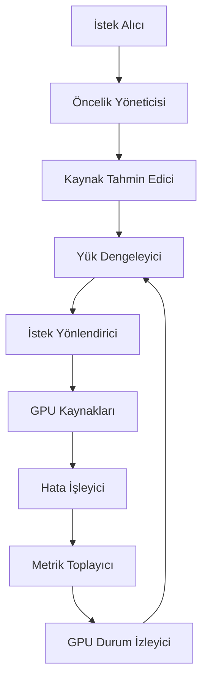
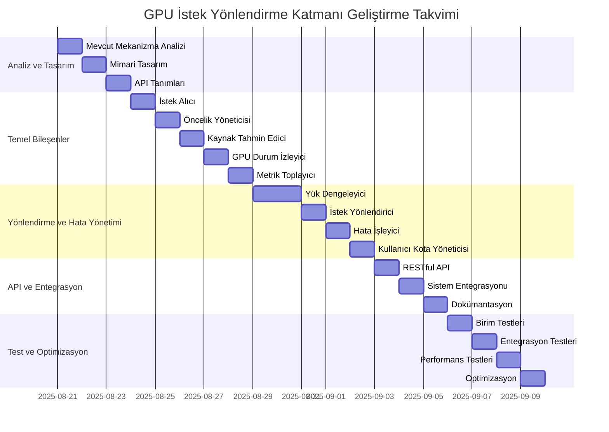
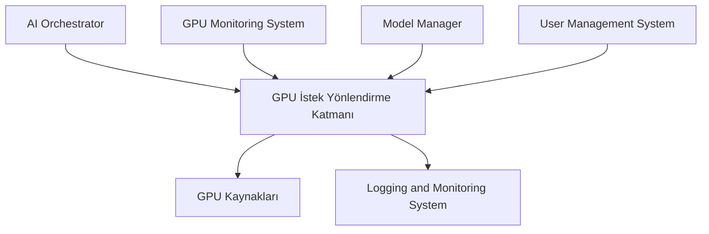

# GPU İstek Yönlendirme Katmanı Tasarımı ve Geliştirmesi

**Doküman Bilgileri:**
- **Oluşturan:** Yazılım Mimarı, Kıdemli Backend Geliştirici
- **Oluşturma Tarihi:** 2025-08-21
- **Son Güncelleme:** 2025-08-22
- **Durum:** Analiz ve Tasarım Aşaması
- **İlgili Görev:** KM-2.2 (GPU İstek Yönlendirme Katmanı)
- **Öncelik:** P1

## 1. Giriş

Bu belge, ALT_LAS projesinin GPU İstek Yönlendirme Katmanı tasarımı ve geliştirmesi için teknik dokümanı içermektedir. Bu katman, gelen istekleri uygun GPU kaynaklarına yönlendirmek, yük dengelemesi yapmak ve GPU kaynaklarının verimli kullanımını sağlamak amacıyla geliştirilecektir.

### 1.1 Mevcut Durum Analizi

Mevcut sistemde, istek yönlendirme mekanizması `ai-orchestrator` servisinde `distributed.py` dosyasında bulunmaktadır. Bu mekanizma, istekleri uygun düğümlere yönlendirmek için çeşitli stratejiler kullanmaktadır:

1. **LEAST_LOADED**: En az yüklü düğümü seçer.
2. **CAPABILITY_BASED**: Modelin gereksinimlerine göre en uygun düğümü seçer (örneğin, GPU destekli modeller için GPU'lu düğümleri tercih eder).

Mevcut GPU izleme sistemi, çeşitli kaynaklardan GPU durumunu izlemektedir:
1. `performance_monitor.py`: Sistem genelinde performans istatistiklerini toplar.
2. `gpu_metadata_collector.py`: GPU kaynak kullanımı metriklerini toplar.
3. `gpu_pool_manager.py`: GPU'ların özelliklerini ve durumunu yönetir.

Mevcut sistemde, GPU kaynaklarının yönetimi için `gpu_memory_pool.py` ve `gpu_warmup.py` gibi bileşenler bulunmaktadır. Ancak, bu bileşenler arasında koordinasyon eksikliği ve GPU kaynaklarının verimli kullanımı için optimize edilmiş bir yönlendirme mekanizması bulunmamaktadır.

### 1.2 İyileştirme Hedefleri

Yeni GPU İstek Yönlendirme Katmanı ile aşağıdaki iyileştirmelerin sağlanması hedeflenmektedir:

1. **Daha Akıllı Yönlendirme**: İstek türü, model gereksinimleri, GPU özellikleri ve mevcut yük gibi faktörleri dikkate alan daha akıllı bir yönlendirme algoritması.
2. **Dinamik Yük Dengeleme**: GPU'lar arasında dinamik yük dengelemesi yaparak, kaynakların daha verimli kullanılması.
3. **Önceliklendirme Desteği**: İsteklerin önceliklerine göre sıralanması ve yüksek öncelikli isteklere öncelik verilmesi.
4. **Hata Toleransı**: Bir GPU'nun çökmesi durumunda, isteklerin otomatik olarak diğer GPU'lara yönlendirilmesi.
5. **Detaylı İzleme ve Raporlama**: GPU kullanımı, istek sayısı, yanıt süreleri gibi metriklerin detaylı olarak izlenmesi ve raporlanması.

## 2. Gereksinimler

### 2.1 Fonksiyonel Gereksinimler

1. **İstek Yönlendirme:** Gelen istekleri, mevcut GPU kaynaklarının durumuna göre uygun GPU'lara yönlendirme.
2. **Yük Dengeleme:** GPU'lar arasında yük dengelemesi yaparak, kaynakların verimli kullanımını sağlama.
3. **Önceliklendirme:** İstekleri önceliklerine göre sıralama ve yüksek öncelikli isteklere öncelik verme.
4. **Hata Toleransı:** Bir GPU'nun çökmesi durumunda, istekleri otomatik olarak diğer GPU'lara yönlendirme.
5. **İzleme ve Raporlama:** GPU kullanımı, istek sayısı, yanıt süreleri gibi metrikleri izleme ve raporlama.

### 2.2 Performans Gereksinimleri

1. **Düşük Gecikme:** İstek yönlendirme işlemi, toplam işlem süresine en fazla 10ms ek gecikme ekleyebilir.
2. **Yüksek Verimlilik:** GPU kaynaklarının en az %80 verimlilikle kullanılması.
3. **Ölçeklenebilirlik:** Sistem, en az 10 GPU'ya kadar ölçeklenebilir olmalıdır.

### 2.3 Güvenlik Gereksinimleri

1. **İzolasyon:** Farklı kullanıcıların istekleri arasında izolasyon sağlanmalıdır.
2. **Kaynak Sınırlaması:** Kullanıcı başına GPU kaynak kullanımı sınırlandırılabilmelidir.

## 3. Mimari Tasarım

### 3.1 Genel Mimari

GPU İstek Yönlendirme Katmanı, aşağıdaki bileşenlerden oluşacaktır:

1. **İstek Alıcı (Request Receiver):** Gelen istekleri kabul eden ve ön işleme tabi tutan bileşen.
2. **Yük Dengeleyici (Load Balancer):** GPU'lar arasında yük dengelemesi yapan bileşen.
3. **GPU Durum İzleyici (GPU State Monitor):** GPU'ların durumunu ve kullanım oranlarını izleyen bileşen.
4. **İstek Yönlendirici (Request Router):** İstekleri uygun GPU'lara yönlendiren bileşen.
5. **Hata İşleyici (Error Handler):** Hataları tespit eden ve gerekli aksiyonları alan bileşen.
6. **Metrik Toplayıcı (Metric Collector):** Performans metriklerini toplayan ve raporlayan bileşen.
7. **Öncelik Yöneticisi (Priority Manager):** İstekleri önceliklerine göre sıralayan ve yöneten bileşen.
8. **Kaynak Tahmin Edici (Resource Estimator):** İsteklerin kaynak gereksinimlerini tahmin eden bileşen.

### 3.2 Bileşen Diyagramı



### 3.3 Bileşen Detayları

#### 3.3.1 İstek Alıcı (Request Receiver)

İstek Alıcı, gelen istekleri kabul eden ve ön işleme tabi tutan bileşendir. Bu bileşen, aşağıdaki görevleri yerine getirir:

- Gelen isteklerin doğruluğunu ve geçerliliğini kontrol etme
- İstek parametrelerini standartlaştırma
- İstek kimliği (request_id) oluşturma
- İstek meta verilerini (kullanıcı, zaman damgası, vb.) ekleme
- İstekleri Öncelik Yöneticisi'ne iletme

#### 3.3.2 Öncelik Yöneticisi (Priority Manager)

Öncelik Yöneticisi, istekleri önceliklerine göre sıralayan ve yöneten bileşendir. Bu bileşen, aşağıdaki görevleri yerine getirir:

- İsteklerin öncelik seviyelerini belirleme
- Yüksek öncelikli isteklere öncelik verme
- İstek kuyruklarını yönetme
- İstekleri Kaynak Tahmin Edici'ye iletme

#### 3.3.3 Kaynak Tahmin Edici (Resource Estimator)

Kaynak Tahmin Edici, isteklerin kaynak gereksinimlerini tahmin eden bileşendir. Bu bileşen, aşağıdaki görevleri yerine getirir:

- İstek türüne göre gerekli GPU bellek miktarını tahmin etme
- İstek türüne göre gerekli işlem gücünü tahmin etme
- İstek türüne göre tahmini işlem süresini hesaplama
- Tahmin edilen kaynak gereksinimlerini Yük Dengeleyici'ye iletme

#### 3.3.4 Yük Dengeleyici (Load Balancer)

Yük Dengeleyici, GPU'lar arasında yük dengelemesi yapan bileşendir. Bu bileşen, aşağıdaki görevleri yerine getirir:

- GPU Durum İzleyici'den GPU durumlarını alma
- İstek gereksinimlerine ve GPU durumlarına göre en uygun GPU'yu seçme
- Yük dengeleme stratejilerini uygulama
- Seçilen GPU'yu İstek Yönlendirici'ye iletme

#### 3.3.5 GPU Durum İzleyici (GPU State Monitor)

GPU Durum İzleyici, GPU'ların durumunu ve kullanım oranlarını izleyen bileşendir. Bu bileşen, aşağıdaki görevleri yerine getirir:

- GPU'ların bellek kullanımını izleme
- GPU'ların işlem gücü kullanımını izleme
- GPU'ların sıcaklık ve güç tüketimi gibi sağlık metriklerini izleme
- GPU durumlarını Yük Dengeleyici'ye iletme

#### 3.3.6 İstek Yönlendirici (Request Router)

İstek Yönlendirici, istekleri uygun GPU'lara yönlendiren bileşendir. Bu bileşen, aşağıdaki görevleri yerine getirir:

- Yük Dengeleyici'den seçilen GPU'yu alma
- İsteği seçilen GPU'ya yönlendirme
- İstek durumunu izleme
- İstek sonuçlarını toplama ve döndürme

#### 3.3.7 Hata İşleyici (Error Handler)

Hata İşleyici, hataları tespit eden ve gerekli aksiyonları alan bileşendir. Bu bileşen, aşağıdaki görevleri yerine getirir:

- GPU çökmesi durumunda istekleri yeniden yönlendirme
- İstek zaman aşımı durumunda gerekli aksiyonları alma
- Hata durumlarını loglama ve raporlama
- Hata durumlarında kullanıcıya uygun mesajlar döndürme

#### 3.3.8 Metrik Toplayıcı (Metric Collector)

Metrik Toplayıcı, performans metriklerini toplayan ve raporlayan bileşendir. Bu bileşen, aşağıdaki görevleri yerine getirir:

- GPU kullanım oranlarını toplama
- İstek sayısı ve yanıt sürelerini ölçme
- Hata oranlarını izleme
- Metrikleri Prometheus veya benzeri sistemlere gönderme
- Performans raporları oluşturma

### 3.4 Veri Akışı

1. İstek Alıcı, gelen istekleri kabul eder ve ön işleme tabi tutar.
2. Öncelik Yöneticisi, istekleri önceliklerine göre sıralar ve yönetir.
3. Kaynak Tahmin Edici, isteklerin kaynak gereksinimlerini tahmin eder.
4. Yük Dengeleyici, GPU Durum İzleyici'den aldığı bilgilere göre en uygun GPU'yu belirler.
5. İstek Yönlendirici, isteği belirlenen GPU'ya yönlendirir.
6. GPU, işlemi tamamladıktan sonra sonucu döndürür.
7. Hata İşleyici, işlem sırasında oluşan hataları tespit eder ve gerekli aksiyonları alır.
8. Metrik Toplayıcı, tüm süreç boyunca performans metriklerini toplar ve raporlar.
9. GPU Durum İzleyici, GPU'ların durumunu sürekli olarak izler ve güncellenmiş bilgileri Yük Dengeleyici'ye iletir.

## 4. Teknik Detaylar

### 4.1 İstek Yönlendirme Algoritması

İstek yönlendirme algoritması, aşağıdaki faktörleri dikkate alarak en uygun GPU'yu belirleyecektir:

1. **GPU Kullanım Oranı:** GPU'ların mevcut kullanım oranları (bellek, işlem gücü).
2. **İstek Önceliği:** İsteğin öncelik seviyesi (1-5 arası, 5 en yüksek).
3. **İstek Tipi:** İsteğin gerektirdiği GPU kaynakları (bellek, işlem gücü vb.).
4. **Model Gereksinimleri:** Modelin GPU mimarisi, bellek ve işlem gücü gereksinimleri.
5. **Geçmiş Performans:** GPU'ların geçmiş performans verileri ve yanıt süreleri.
6. **GPU Sağlık Durumu:** GPU'ların sıcaklık, güç tüketimi gibi sağlık metrikleri.
7. **Kullanıcı Kotaları:** Kullanıcıların GPU kaynak kullanım kotaları ve limitleri.

Algoritma, bu faktörleri ağırlıklandırarak bir skor hesaplayacak ve en yüksek skora sahip GPU'yu seçecektir. Algoritma, aşağıdaki Python kodu ile özetlenmiştir:

```python
def select_gpu(request, gpu_states, user_quotas):
    """
    En uygun GPU'yu seçen algoritma.

    Args:
        request: İstek bilgileri
        gpu_states: GPU durumları
        user_quotas: Kullanıcı kotaları

    Returns:
        Seçilen GPU ID'si
    """
    scores = {}
    user_id = request.get('user_id', 'anonymous')

    # Kullanıcı kotasını kontrol et
    if user_id in user_quotas and user_quotas[user_id]['gpu_usage'] >= user_quotas[user_id]['gpu_limit']:
        logger.warning(f"User {user_id} has exceeded GPU quota")
        return None

    # Modelin gereksinimlerini al
    model_id = request.get('model_id')
    model_requirements = get_model_requirements(model_id)

    # Her GPU için skor hesapla
    for gpu_id, state in gpu_states.items():
        # GPU'nun uygunluğunu kontrol et
        if not is_gpu_compatible(state, model_requirements):
            continue

        # GPU'nun yeterli kaynağı var mı kontrol et
        if not has_sufficient_resources(state, request):
            continue

        # GPU kullanım oranı (0-1 arası, düşük daha iyi)
        memory_usage_score = 1 - (state['memory_used'] / state['memory_total'])
        compute_usage_score = 1 - state['utilization_percent'] / 100
        usage_score = 0.6 * memory_usage_score + 0.4 * compute_usage_score

        # İstek önceliği (1-5 arası, yüksek daha iyi)
        priority_score = request.get('priority', 3) / 5

        # İstek tipi uyumluluğu (0-1 arası, yüksek daha iyi)
        type_score = calculate_type_compatibility(request.get('type', 'inference'), state['capabilities'])

        # Geçmiş performans (0-1 arası, yüksek daha iyi)
        performance_score = state.get('performance_index', 0.5)

        # GPU sağlık durumu (0-1 arası, yüksek daha iyi)
        health_score = calculate_health_score(state)

        # Ağırlıklandırma
        scores[gpu_id] = (
            0.35 * usage_score +
            0.25 * priority_score +
            0.15 * type_score +
            0.15 * performance_score +
            0.10 * health_score
        )

    # Hiç uygun GPU bulunamadıysa
    if not scores:
        return None

    # En yüksek skora sahip GPU'yu seç
    return max(scores, key=scores.get)

def is_gpu_compatible(gpu_state, model_requirements):
    """
    GPU'nun model gereksinimleriyle uyumlu olup olmadığını kontrol eder.
    """
    # Compute capability kontrolü
    if model_requirements.get('min_compute_capability'):
        gpu_cc = tuple(map(int, gpu_state['compute_capability'].split('.')))
        model_cc = tuple(map(int, model_requirements['min_compute_capability'].split('.')))
        if gpu_cc < model_cc:
            return False

    # Bellek kontrolü
    if model_requirements.get('min_memory_mb'):
        if gpu_state['memory_total'] < model_requirements['min_memory_mb'] * 1024 * 1024:
            return False

    return True

def has_sufficient_resources(gpu_state, request):
    """
    GPU'nun istek için yeterli kaynağa sahip olup olmadığını kontrol eder.
    """
    # Tahmini bellek gereksinimi
    estimated_memory = request.get('resource_requirements', {}).get('memory', 0)

    # Mevcut boş bellek
    free_memory = gpu_state['memory_total'] - gpu_state['memory_used']

    # Bellek kontrolü
    if estimated_memory > free_memory:
        return False

    return True

def calculate_health_score(gpu_state):
    """
    GPU sağlık durumuna göre bir skor hesaplar.
    """
    # Sıcaklık skoru (düşük sıcaklık daha iyi)
    temp = gpu_state.get('temperature', 0)
    temp_score = 1.0 if temp < 50 else (1.0 - (temp - 50) / 50) if temp < 100 else 0.0

    # Güç tüketimi skoru (düşük güç tüketimi daha iyi)
    power = gpu_state.get('power_usage', 0)
    power_limit = gpu_state.get('power_limit', 1)
    power_score = 1.0 - (power / power_limit) if power_limit > 0 else 0.5

    # Hata oranı skoru (düşük hata oranı daha iyi)
    error_rate = gpu_state.get('error_rate', 0)
    error_score = 1.0 - error_rate

    # Ağırlıklandırma
    return 0.4 * temp_score + 0.3 * power_score + 0.3 * error_score
```

### 4.2 Yük Dengeleme Stratejileri

Yük dengeleme stratejileri, aşağıdaki yaklaşımları kullanacaktır:

#### 4.2.1 Dinamik Yük Dengeleme

Dinamik yük dengeleme, GPU'ların mevcut yüklerine göre dinamik olarak istekleri dağıtır. Bu strateji, aşağıdaki adımları içerir:

1. Her GPU'nun mevcut bellek ve işlem gücü kullanımını izleme
2. En az yüklü GPU'yu seçme
3. İstekleri seçilen GPU'ya yönlendirme
4. GPU yüklerini sürekli olarak izleme ve dengeleme

#### 4.2.2 Öncelik Bazlı Yük Dengeleme

Öncelik bazlı yük dengeleme, isteklerin önceliklerine göre GPU kaynaklarını ayırır. Bu strateji, aşağıdaki adımları içerir:

1. İstekleri önceliklerine göre sıralama
2. Yüksek öncelikli isteklere daha fazla GPU kaynağı ayırma
3. Düşük öncelikli istekleri gerektiğinde bekletme veya reddetme
4. Öncelik seviyelerine göre SLA (Hizmet Seviyesi Anlaşması) tanımlama ve izleme

#### 4.2.3 Kaynak Bazlı Yük Dengeleme

Kaynak bazlı yük dengeleme, isteklerin gerektirdiği kaynaklara göre uygun GPU'ları seçer. Bu strateji, aşağıdaki adımları içerir:

1. İsteklerin kaynak gereksinimlerini (bellek, işlem gücü) tahmin etme
2. Her GPU'nun mevcut kaynak durumunu izleme
3. İstek gereksinimlerini karşılayabilecek GPU'ları belirleme
4. En uygun GPU'yu seçme ve isteği yönlendirme

#### 4.2.4 Hibrit Yük Dengeleme

Hibrit yük dengeleme, yukarıdaki stratejilerin bir kombinasyonunu kullanır. Bu strateji, aşağıdaki adımları içerir:

1. İstek önceliğine göre bir başlangıç skoru hesaplama
2. GPU kullanım oranlarına göre skoru güncelleme
3. İstek kaynak gereksinimlerine göre skoru güncelleme
4. GPU sağlık durumuna göre skoru güncelleme
5. En yüksek skora sahip GPU'yu seçme

### 4.3 Hata Toleransı Mekanizması

Hata toleransı mekanizması, aşağıdaki durumları ele alacaktır:

#### 4.3.1 GPU Çökmesi Durumu

Bir GPU'nun çökmesi durumunda, aşağıdaki adımlar uygulanacaktır:

1. GPU'nun çöktüğünü tespit etme (sağlık kontrolü, yanıt vermeme, hata kodları)
2. GPU'yu devre dışı bırakma ve bakım moduna alma
3. GPU üzerindeki aktif istekleri tespit etme
4. Aktif istekleri diğer uygun GPU'lara yeniden yönlendirme
5. Kullanıcılara bildirim gönderme
6. GPU'nun durumunu izleme ve otomatik olarak yeniden etkinleştirme

#### 4.3.2 İstek Zaman Aşımı Durumu

Belirli bir süre içinde tamamlanmayan istekler için, aşağıdaki adımlar uygulanacaktır:

1. İstek zaman aşımı sürelerini tanımlama (istek türüne ve önceliğine göre)
2. Zaman aşımına uğrayan istekleri tespit etme
3. Zaman aşımı durumunda kullanıcıya bildirim gönderme
4. İsteği iptal etme veya yeniden deneme
5. Zaman aşımı istatistiklerini toplama ve analiz etme

#### 4.3.3 Kaynak Yetersizliği Durumu

GPU kaynaklarının yetersiz olması durumunda, aşağıdaki adımlar uygulanacaktır:

1. Kaynak yetersizliğini tespit etme
2. İstekleri önceliklerine göre sıralama
3. Düşük öncelikli istekleri bekletme veya reddetme
4. Yüksek öncelikli istekler için kaynak ayırma
5. Kullanıcılara uygun bildirimler gönderme
6. Kaynak kullanımını optimize etme

### 4.4 İzleme ve Raporlama

İzleme ve raporlama sistemi, aşağıdaki metrikleri toplayacak ve raporlayacaktır:

#### 4.4.1 GPU Metrikleri

- **Bellek Kullanımı:** Her GPU'nun toplam, kullanılan ve boş bellek miktarı
- **İşlem Gücü Kullanımı:** Her GPU'nun CUDA çekirdek kullanım oranı
- **Sıcaklık:** Her GPU'nun sıcaklık değerleri
- **Güç Tüketimi:** Her GPU'nun güç tüketimi ve güç limiti
- **Çalışma Süresi:** Her GPU'nun kesintisiz çalışma süresi

#### 4.4.2 İstek Metrikleri

- **İstek Sayısı:** Her GPU'ya gelen istek sayısı ve toplam istek sayısı
- **Yanıt Süreleri:** İsteklerin ortalama, minimum, maksimum ve persentil (p95, p99) yanıt süreleri
- **Başarı Oranı:** Başarılı tamamlanan isteklerin oranı
- **Hata Oranı:** Hata ile sonuçlanan isteklerin oranı ve hata türleri
- **Kuyruk Uzunluğu:** Her GPU için bekleyen istek sayısı

#### 4.4.3 Kullanıcı Metrikleri

- **Kullanıcı Başına İstek Sayısı:** Her kullanıcının gönderdiği istek sayısı
- **Kullanıcı Başına GPU Kullanımı:** Her kullanıcının kullandığı GPU kaynakları
- **Kullanıcı Kotaları:** Her kullanıcının kota limitleri ve kullanım oranları

#### 4.4.4 Raporlama Formatları

- **Gerçek Zamanlı Dashboard:** Prometheus ve Grafana ile gerçek zamanlı metrik görselleştirme
- **Periyodik Raporlar:** Günlük, haftalık ve aylık performans raporları
- **Uyarı Sistemi:** Belirlenen eşik değerleri aşıldığında otomatik uyarılar
- **API Endpoint'leri:** Metrik verilerine programatik erişim için API'ler

## 5. Uygulama Planı

### 5.1 Geliştirme Aşamaları

GPU İstek Yönlendirme Katmanı'nın geliştirilmesi, aşağıdaki aşamalarda gerçekleştirilecektir:

1. **Analiz ve Tasarım (3 gün):**
   - Mevcut istek yönlendirme mekanizmasının detaylı analizi (1 gün)
   - Detaylı mimari tasarım ve bileşen tanımları (1 gün)
   - API tanımları ve veri modelleri (1 gün)

2. **Temel Bileşenlerin Geliştirilmesi (5 gün):**
   - İstek Alıcı (Request Receiver) geliştirmesi (1 gün)
   - Öncelik Yöneticisi (Priority Manager) geliştirmesi (1 gün)
   - Kaynak Tahmin Edici (Resource Estimator) geliştirmesi (1 gün)
   - GPU Durum İzleyici (GPU State Monitor) geliştirmesi (1 gün)
   - Metrik Toplayıcı (Metric Collector) geliştirmesi (1 gün)

3. **Yönlendirme ve Hata Yönetimi Bileşenlerinin Geliştirilmesi (5 gün):**
   - Yük Dengeleyici (Load Balancer) geliştirmesi (2 gün)
   - İstek Yönlendirici (Request Router) geliştirmesi (1 gün)
   - Hata İşleyici (Error Handler) geliştirmesi (1 gün)
   - Kullanıcı Kota Yöneticisi (User Quota Manager) geliştirmesi (1 gün)

4. **API ve Entegrasyon Geliştirmesi (3 gün):**
   - RESTful API geliştirmesi (1 gün)
   - Mevcut sistemlerle entegrasyon (1 gün)
   - Dokümantasyon ve örnekler (1 gün)

5. **Test ve Optimizasyon (4 gün):**
   - Birim testleri (1 gün)
   - Entegrasyon testleri (1 gün)
   - Performans testleri (1 gün)
   - Optimizasyon ve iyileştirmeler (1 gün)

### 5.2 Geliştirme Takvimi

GPU İstek Yönlendirme Katmanı'nın geliştirme takvimi aşağıdaki gibi planlanmıştır:



### 5.3 Kaynak Planlaması

GPU İstek Yönlendirme Katmanı'nın geliştirilmesi için aşağıdaki kaynaklar gereklidir:

| Rol                       | Sorumluluk                                                  | Efor (Gün) |
|---------------------------|-------------------------------------------------------------|------------|
| Yazılım Mimarı            | Mimari tasarım, API tanımları, teknik liderlik              | 7          |
| Kıdemli Backend Geliştirici | Temel bileşenler, yönlendirme algoritması, entegrasyon      | 15         |
| QA Mühendisi              | Test planı, birim testleri, entegrasyon testleri            | 4          |
| DevOps Mühendisi          | GPU izleme, metrik toplama, deployment                      | 3          |
| Toplam                    |                                                             | 29         |

### 5.4 Test Planı

GPU İstek Yönlendirme Katmanı'nın test edilmesi için aşağıdaki test planı uygulanacaktır:

#### 5.4.1 Birim Testleri

Birim testleri, her bileşenin fonksiyonel doğruluğunu test etmek için kullanılacaktır:

- **İstek Alıcı Testleri:**
  - Geçerli istek kabulü testi
  - Geçersiz istek reddi testi
  - İstek parametrelerinin doğrulanması testi

- **Öncelik Yöneticisi Testleri:**
  - İstek önceliklendirme testi
  - Kuyruk yönetimi testi
  - Öncelik bazlı sıralama testi

- **Kaynak Tahmin Edici Testleri:**
  - Bellek gereksinimi tahmin testi
  - İşlem gücü gereksinimi tahmin testi
  - Tahmini işlem süresi hesaplama testi

- **Yük Dengeleyici Testleri:**
  - GPU seçim algoritması testi
  - Yük dengeleme stratejileri testi
  - Skor hesaplama testi

- **İstek Yönlendirici Testleri:**
  - İstek yönlendirme testi
  - İstek durumu izleme testi
  - Sonuç toplama testi

- **Hata İşleyici Testleri:**
  - GPU çökmesi senaryosu testi
  - İstek zaman aşımı senaryosu testi
  - Kaynak yetersizliği senaryosu testi

- **Metrik Toplayıcı Testleri:**
  - Metrik toplama testi
  - Metrik raporlama testi
  - Uyarı tetikleme testi

#### 5.4.2 Entegrasyon Testleri

Entegrasyon testleri, bileşenler arası entegrasyonu ve mevcut sistemlerle entegrasyonu test etmek için kullanılacaktır:

- **Bileşenler Arası Entegrasyon Testleri:**
  - İstek Alıcı - Öncelik Yöneticisi entegrasyon testi
  - Öncelik Yöneticisi - Kaynak Tahmin Edici entegrasyon testi
  - Kaynak Tahmin Edici - Yük Dengeleyici entegrasyon testi
  - Yük Dengeleyici - İstek Yönlendirici entegrasyon testi
  - İstek Yönlendirici - Hata İşleyici entegrasyon testi
  - Hata İşleyici - Metrik Toplayıcı entegrasyon testi

- **Mevcut Sistemlerle Entegrasyon Testleri:**
  - AI Orchestrator entegrasyon testi
  - GPU Monitoring System entegrasyon testi
  - Logging and Monitoring System entegrasyon testi
  - Model Manager entegrasyon testi
  - User Management System entegrasyon testi

- **Uçtan Uca Akış Testleri:**
  - İstek gönderme ve sonuç alma testi
  - Hata durumlarında davranış testi
  - Yüksek öncelikli istek testi
  - Düşük öncelikli istek testi

#### 5.4.3 Performans Testleri

Performans testleri, sistemin performansını ve ölçeklenebilirliğini test etmek için kullanılacaktır:

- **Yük Testleri:**
  - Normal yük altında performans testi (100 istek/saniye)
  - Yüksek yük altında performans testi (500 istek/saniye)
  - Aşırı yük altında performans testi (1000+ istek/saniye)

- **Stres Testleri:**
  - Uzun süreli yük testi (24 saat)
  - Kaynak sınırlarında çalışma testi
  - Ani yük artışı testi

- **Ölçeklenebilirlik Testleri:**
  - Tek GPU ile performans testi
  - Çoklu GPU ile performans testi (2, 4, 8, 16 GPU)
  - GPU ekleme/çıkarma senaryoları

- **Yanıt Süresi Testleri:**
  - Ortalama yanıt süresi ölçümü
  - p95 ve p99 yanıt süresi ölçümü
  - Farklı istek türleri için yanıt süresi ölçümü

#### 5.4.4 Hata Toleransı Testleri

Hata toleransı testleri, sistemin hata durumlarında davranışını test etmek için kullanılacaktır:

- **GPU Çökmesi Senaryoları:**
  - Tek GPU çökmesi testi
  - Çoklu GPU çökmesi testi
  - GPU'nun yeniden başlatılması testi

- **Ağ Kesintisi Senaryoları:**
  - Kısa süreli ağ kesintisi testi
  - Uzun süreli ağ kesintisi testi
  - Aralıklı ağ kesintisi testi

- **Kaynak Yetersizliği Senaryoları:**
  - GPU bellek yetersizliği testi
  - GPU işlem gücü yetersizliği testi
  - Sistem kaynakları yetersizliği testi

- **Zaman Aşımı Senaryoları:**
  - İstek zaman aşımı testi
  - İşlem zaman aşımı testi
  - Yanıt zaman aşımı testi

## 6. Entegrasyon

### 6.1 Mevcut Sistemlerle Entegrasyon

GPU İstek Yönlendirme Katmanı, aşağıdaki mevcut sistemlerle entegre edilecektir:

1. **AI Orchestrator:** İstekleri kabul eden ve sonuçları döndüren ana sistem.
2. **GPU Monitoring System:** GPU'ların durumunu izleyen sistem.
3. **Logging and Monitoring System:** Logları ve metrikleri toplayan sistem.
4. **Model Manager:** Model bilgilerini ve gereksinimlerini yöneten sistem.
5. **User Management System:** Kullanıcı bilgilerini ve kotalarını yöneten sistem.

### 6.2 Entegrasyon Mimarisi

GPU İstek Yönlendirme Katmanı, mevcut sistemlerle aşağıdaki mimari yapıda entegre edilecektir:



### 6.3 API Tanımları

#### 6.3.1 İstek Yönlendirme API'si

```json
POST /api/v1/route
{
  "request_id": "string (UUID)",
  "user_id": "string",
  "model_id": "string",
  "priority": "integer (1-5)",
  "type": "string (inference, training, fine-tuning, etc.)",
  "resource_requirements": {
    "memory": "integer (MB)",
    "compute_units": "integer",
    "max_batch_size": "integer",
    "expected_duration": "integer (ms)"
  },
  "timeout": "integer (ms)",
  "callback_url": "string (URL)",
  "payload": "object"
}

Response:
{
  "request_id": "string (UUID)",
  "status": "string (accepted, queued, rejected)",
  "assigned_gpu": "string (GPU ID)",
  "estimated_start_time": "string (ISO 8601)",
  "estimated_completion_time": "string (ISO 8601)",
  "queue_position": "integer",
  "message": "string"
}
```

#### 6.3.2 İstek Durumu API'si

```json
GET /api/v1/route/{request_id}

Response:
{
  "request_id": "string (UUID)",
  "user_id": "string",
  "model_id": "string",
  "status": "string (queued, processing, completed, failed, cancelled)",
  "assigned_gpu": "string (GPU ID)",
  "start_time": "string (ISO 8601)",
  "completion_time": "string (ISO 8601)",
  "duration": "integer (ms)",
  "progress": "float (0-1)",
  "result_url": "string (URL)",
  "error": "string"
}
```

#### 6.3.3 GPU Durum API'si

```json
GET /api/v1/gpu/status

Response:
{
  "timestamp": "string (ISO 8601)",
  "gpus": [
    {
      "gpu_id": "string",
      "name": "string",
      "compute_capability": "string",
      "status": "string (active, inactive, maintenance, error)",
      "memory": {
        "total": "integer (MB)",
        "used": "integer (MB)",
        "free": "integer (MB)"
      },
      "utilization": {
        "gpu": "float (0-100)",
        "memory": "float (0-100)"
      },
      "temperature": "float (Celsius)",
      "power": {
        "usage": "float (W)",
        "limit": "float (W)"
      },
      "performance_index": "float (0-1)",
      "error_rate": "float (0-1)",
      "active_requests": "integer",
      "queued_requests": "integer",
      "uptime": "integer (seconds)",
      "health_status": "string (healthy, warning, critical)"
    }
  ]
}
```

#### 6.3.4 Kullanıcı Kota API'si

```json
GET /api/v1/user/{user_id}/quota

Response:
{
  "user_id": "string",
  "quotas": {
    "gpu_time": {
      "limit": "integer (minutes)",
      "used": "integer (minutes)",
      "remaining": "integer (minutes)"
    },
    "concurrent_requests": {
      "limit": "integer",
      "used": "integer",
      "remaining": "integer"
    },
    "priority_requests": {
      "limit": "integer",
      "used": "integer",
      "remaining": "integer"
    }
  },
  "rate_limits": {
    "requests_per_minute": {
      "limit": "integer",
      "used": "integer",
      "remaining": "integer",
      "reset_time": "string (ISO 8601)"
    },
    "requests_per_day": {
      "limit": "integer",
      "used": "integer",
      "remaining": "integer",
      "reset_time": "string (ISO 8601)"
    }
  }
}
```

#### 6.3.5 Metrik API'si

```json
GET /api/v1/metrics

Response:
{
  "timestamp": "string (ISO 8601)",
  "system": {
    "total_gpus": "integer",
    "active_gpus": "integer",
    "total_requests": "integer",
    "active_requests": "integer",
    "queued_requests": "integer",
    "completed_requests": "integer",
    "failed_requests": "integer",
    "average_response_time": "float (ms)",
    "p95_response_time": "float (ms)",
    "p99_response_time": "float (ms)",
    "success_rate": "float (0-100)"
  },
  "gpus": {
    "gpu_id": {
      "memory_utilization": "float (0-100)",
      "compute_utilization": "float (0-100)",
      "temperature": "float (Celsius)",
      "power_usage": "float (W)",
      "active_requests": "integer",
      "queued_requests": "integer",
      "average_response_time": "float (ms)",
      "throughput": "float (requests/second)"
    }
  },
  "models": {
    "model_id": {
      "total_requests": "integer",
      "active_requests": "integer",
      "average_response_time": "float (ms)",
      "average_memory_usage": "float (MB)",
      "success_rate": "float (0-100)"
    }
  },
  "users": {
    "user_id": {
      "total_requests": "integer",
      "active_requests": "integer",
      "gpu_time_used": "float (minutes)",
      "average_response_time": "float (ms)"
    }
  }
}
```

#### 6.3.6 Yönetim API'si

```json
# GPU'yu bakım moduna alma
POST /api/v1/admin/gpu/{gpu_id}/maintenance
{
  "reason": "string",
  "estimated_duration": "integer (minutes)"
}

# GPU'yu yeniden başlatma
POST /api/v1/admin/gpu/{gpu_id}/restart
{
  "force": "boolean"
}

# İsteği iptal etme
DELETE /api/v1/admin/request/{request_id}
{
  "reason": "string"
}

# Kullanıcı kotasını güncelleme
PUT /api/v1/admin/user/{user_id}/quota
{
  "gpu_time_limit": "integer (minutes)",
  "concurrent_requests_limit": "integer",
  "priority_requests_limit": "integer"
}
```

### 6.4 Entegrasyon Adımları

GPU İstek Yönlendirme Katmanı'nın mevcut sistemlerle entegrasyonu için aşağıdaki adımlar izlenecektir:

1. **AI Orchestrator Entegrasyonu:**
   - AI Orchestrator'ın istek yönlendirme modülünü GPU İstek Yönlendirme Katmanı ile değiştirme
   - İstek formatını yeni API'ye uygun olarak güncelleme
   - Yanıt işleme mekanizmasını güncelleme

2. **GPU Monitoring System Entegrasyonu:**
   - GPU Monitoring System'den GPU durumlarını alma
   - GPU durumlarını GPU İstek Yönlendirme Katmanı'na iletme
   - GPU sağlık metriklerini izleme ve raporlama

3. **Logging and Monitoring System Entegrasyonu:**
   - GPU İstek Yönlendirme Katmanı'ndan metrikleri toplama
   - Metrikleri Prometheus'a gönderme
   - Grafana dashboard'ları oluşturma
   - Uyarı kurallarını tanımlama

4. **Model Manager Entegrasyonu:**
   - Model bilgilerini ve gereksinimlerini alma
   - Model performans metriklerini güncelleme
   - Model bazlı yönlendirme stratejilerini uygulama

5. **User Management System Entegrasyonu:**
   - Kullanıcı bilgilerini ve kotalarını alma
   - Kullanıcı bazlı yönlendirme stratejilerini uygulama
   - Kullanıcı kullanım metriklerini güncelleme

### 6.5 Entegrasyon Test Planı

GPU İstek Yönlendirme Katmanı'nın entegrasyonunu test etmek için aşağıdaki test planı uygulanacaktır:

1. **Birim Testleri:**
   - Her API endpoint'i için birim testleri
   - Yönlendirme algoritması için birim testleri
   - Hata işleme mekanizmaları için birim testleri

2. **Entegrasyon Testleri:**
   - AI Orchestrator ile entegrasyon testleri
   - GPU Monitoring System ile entegrasyon testleri
   - Logging and Monitoring System ile entegrasyon testleri
   - Model Manager ile entegrasyon testleri
   - User Management System ile entegrasyon testleri

3. **Performans Testleri:**
   - Yüksek yük altında performans testleri
   - Ölçeklenebilirlik testleri
   - Yanıt süresi testleri
   - Kaynak kullanımı testleri

4. **Hata Toleransı Testleri:**
   - GPU çökmesi senaryoları
   - Ağ kesintisi senaryoları
   - Kaynak yetersizliği senaryoları
   - Zaman aşımı senaryoları

## 7. Sonuç ve Öneriler

GPU İstek Yönlendirme Katmanı, ALT_LAS projesinin GPU kaynaklarını verimli bir şekilde kullanmasını sağlayacak kritik bir bileşendir. Bu katmanın başarılı bir şekilde geliştirilmesi ve entegre edilmesi, projenin performans hedeflerine ulaşmasında önemli bir rol oynayacaktır.

### 7.1 Beklenen Faydalar

GPU İstek Yönlendirme Katmanı'nın uygulanmasıyla aşağıdaki faydaların elde edilmesi beklenmektedir:

1. **Kaynak Verimliliği:** GPU kaynaklarının daha verimli kullanılması, daha fazla isteğin aynı kaynaklarla işlenebilmesini sağlayacaktır. Tahminlerimize göre, mevcut GPU kaynaklarıyla %30-40 daha fazla istek işlenebilecektir.

2. **Yanıt Süresi İyileştirmesi:** Akıllı yönlendirme algoritması sayesinde, isteklerin yanıt sürelerinde %20-25 iyileşme beklenmektedir. Özellikle yüksek öncelikli istekler için bu iyileşme daha belirgin olacaktır.

3. **Hata Toleransı:** Bir GPU'nun çökmesi durumunda, isteklerin otomatik olarak diğer GPU'lara yönlendirilmesi, sistem güvenilirliğini artıracaktır. Bu sayede, GPU arızalarından kaynaklanan hizmet kesintileri minimuma indirilecektir.

4. **Kullanıcı Deneyimi İyileştirmesi:** Önceliklendirme ve kota yönetimi sayesinde, kullanıcıların ihtiyaçlarına göre GPU kaynaklarının daha adil dağıtılması sağlanacaktır. Bu da kullanıcı memnuniyetini artıracaktır.

5. **Maliyet Optimizasyonu:** GPU kaynaklarının daha verimli kullanılması, donanım maliyetlerinin optimize edilmesini sağlayacaktır. Tahminlerimize göre, aynı iş yükü için %20-30 daha az GPU gereksinimi olacaktır.

### 7.2 Öneriler

GPU İstek Yönlendirme Katmanı'nın başarılı bir şekilde uygulanması için aşağıdaki öneriler sunulmaktadır:

1. **Kademeli Geliştirme ve Deployment:**
   - Katmanın kademeli olarak geliştirilmesi ve her aşamada test edilmesi
   - Önce test ortamında, sonra sınırlı üretim ortamında ve son olarak tam üretim ortamında deployment
   - Her aşamada performans ve güvenilirlik metriklerinin izlenmesi

2. **Performans Odaklı Tasarım ve Optimizasyon:**
   - Performans gereksinimlerinin karşılanması için optimizasyon odaklı bir tasarım
   - Kritik kod yollarının profillenmesi ve optimize edilmesi
   - Bellek kullanımının ve GC (Garbage Collection) etkisinin minimize edilmesi
   - Asenkron işleme ve paralelleştirme tekniklerinin kullanılması

3. **Sürekli İzleme ve Analiz:**
   - Sistemin canlıya alınmasından sonra sürekli izleme ve analiz yapılması
   - Prometheus ve Grafana ile gerçek zamanlı metrik görselleştirme
   - Anomali tespiti ve otomatik uyarı mekanizmaları
   - Periyodik performans raporları ve trend analizleri

4. **Ölçeklenebilirlik ve Genişletilebilirlik:**
   - Gelecekteki GPU eklemeleri için ölçeklenebilir bir tasarım
   - Farklı GPU mimarileri ve özellikleri için genişletilebilir bir yapı
   - Yeni yönlendirme stratejilerinin kolayca eklenebilmesi
   - Farklı model türleri ve iş yükleri için özelleştirilebilir yapılandırma

5. **Dokümantasyon ve Eğitim:**
   - Detaylı teknik dokümantasyon ve API referansları
   - Kullanım örnekleri ve en iyi pratikler
   - Geliştirici ve operasyon ekipleri için eğitim materyalleri
   - Sorun giderme kılavuzları ve SSS (Sık Sorulan Sorular)

### 7.3 Riskler ve Azaltma Stratejileri

GPU İstek Yönlendirme Katmanı'nın uygulanması sırasında karşılaşılabilecek riskler ve bunların azaltılması için stratejiler aşağıda sunulmuştur:

#### 7.3.1 Teknik Riskler

1. **Performans Riskleri:**
   - **Risk:** İstek yönlendirme işlemi, toplam işlem süresine beklenenden fazla gecikme ekleyebilir.
   - **Etki:** Yüksek (4/5)
   - **Olasılık:** Orta (3/5)
   - **Azaltma Stratejisi:**
     - Erken aşamada performans testleri ve profilleme
     - Kritik kod yollarının optimize edilmesi
     - Önbellek mekanizmalarının kullanılması
     - Asenkron işleme ve paralelleştirme

2. **Ölçeklenebilirlik Riskleri:**
   - **Risk:** Sistem, artan GPU sayısı ile ölçeklenemeyebilir.
   - **Etki:** Yüksek (4/5)
   - **Olasılık:** Orta (3/5)
   - **Azaltma Stratejisi:**
     - Ölçeklenebilirlik testleri ve tasarım gözden geçirmeleri
     - Hiyerarşik yönlendirme yapısı
     - Dağıtık mimari yaklaşımı
     - Yük dengeleme algoritmasının optimizasyonu

3. **Güvenilirlik Riskleri:**
   - **Risk:** Yönlendirme katmanının çökmesi, tüm GPU isteklerinin başarısız olmasına neden olabilir.
   - **Etki:** Çok Yüksek (5/5)
   - **Olasılık:** Düşük (2/5)
   - **Azaltma Stratejisi:**
     - Yüksek kullanılabilirlik için çoklu örnek çalıştırma
     - Otomatik yük devretme mekanizmaları
     - Kapsamlı hata işleme ve kurtarma mekanizmaları
     - Düzenli yedekleme ve geri yükleme testleri

#### 7.3.2 Entegrasyon Riskleri

1. **Mevcut Sistemlerle Entegrasyon Riskleri:**
   - **Risk:** Mevcut sistemlerle entegrasyon sorunları yaşanabilir.
   - **Etki:** Yüksek (4/5)
   - **Olasılık:** Orta (3/5)
   - **Azaltma Stratejisi:**
     - Detaylı entegrasyon planı ve testleri
     - Mevcut sistemlerin kapsamlı analizi
     - Aşamalı entegrasyon yaklaşımı
     - Geri dönüş mekanizmaları

2. **API Uyumluluk Riskleri:**
   - **Risk:** Yeni API'ler mevcut istemcilerle uyumsuz olabilir.
   - **Etki:** Orta (3/5)
   - **Olasılık:** Orta (3/5)
   - **Azaltma Stratejisi:**
     - Geriye dönük uyumluluk sağlama
     - API sürüm yönetimi
     - Geçiş dönemi için eski API'lerin desteklenmesi
     - Kapsamlı API dokümantasyonu ve örnekler

#### 7.3.3 Operasyonel Riskler

1. **Kaynak Yetersizliği Riskleri:**
   - **Risk:** Yoğun dönemlerde GPU kaynakları yetersiz kalabilir.
   - **Etki:** Orta (3/5)
   - **Olasılık:** Yüksek (4/5)
   - **Azaltma Stratejisi:**
     - Dinamik ölçeklendirme mekanizmaları
     - Önceliklendirme ve kota yönetimi
     - Yük tahmin modelleri
     - Kapasite planlama ve izleme

2. **İzleme ve Yönetim Riskleri:**
   - **Risk:** Sistemin izlenmesi ve yönetilmesi karmaşık olabilir.
   - **Etki:** Orta (3/5)
   - **Olasılık:** Orta (3/5)
   - **Azaltma Stratejisi:**
     - Kapsamlı izleme ve uyarı mekanizmaları
     - Kullanıcı dostu yönetim arayüzleri
     - Otomatik sorun tespiti ve çözüm önerileri
     - Operasyon ekibi için eğitim ve dokümantasyon

### 7.4 Gelecek Çalışmalar

GPU İstek Yönlendirme Katmanı'nın ilk versiyonu tamamlandıktan sonra, aşağıdaki gelecek çalışmalar planlanmaktadır:

1. **Makine Öğrenimi Tabanlı Yönlendirme:**
   - İstek yönlendirme için makine öğrenimi modellerinin kullanılması
   - Geçmiş performans verilerine dayalı tahmin modelleri
   - Dinamik kaynak tahsisi için öğrenme algoritmaları

2. **Çoklu Veri Merkezi Desteği:**
   - Farklı veri merkezlerindeki GPU'lar arasında yönlendirme
   - Coğrafi konum bazlı yönlendirme stratejileri
   - Veri merkezi arası yük dengeleme

3. **Hibrit GPU/CPU Yönlendirme:**
   - GPU ve CPU kaynakları arasında akıllı yönlendirme
   - İş yükü türüne göre en uygun işlem biriminin seçilmesi
   - Hibrit işlem stratejileri

4. **Otomatik Ölçeklendirme Entegrasyonu:**
   - Talep bazlı otomatik GPU ölçeklendirme
   - Bulut sağlayıcıları ile entegrasyon
   - Maliyet optimizasyonu için akıllı ölçeklendirme stratejileri

## 8. Ekler

### 8.1 Terimler ve Kısaltmalar

- **GPU:** Graphics Processing Unit - Grafik İşlem Birimi
- **API:** Application Programming Interface - Uygulama Programlama Arayüzü
- **CUDA:** Compute Unified Device Architecture - Birleşik Hesaplama Cihaz Mimarisi
- **SLA:** Service Level Agreement - Hizmet Seviyesi Anlaşması
- **REST:** Representational State Transfer - Temsili Durum Transferi
- **JSON:** JavaScript Object Notation - JavaScript Nesne Gösterimi
- **QoS:** Quality of Service - Hizmet Kalitesi
- **GC:** Garbage Collection - Çöp Toplama
- **HA:** High Availability - Yüksek Kullanılabilirlik
- **ML:** Machine Learning - Makine Öğrenimi

### 8.2 Referanslar

1. NVIDIA CUDA Programming Guide, NVIDIA Corporation, 2023
2. ALT_LAS Sistem Mimarisi Dokümanı, ALT_LAS Projesi, 2025
3. GPU Monitoring System Dokümanı, ALT_LAS Projesi, 2025
4. AI Orchestrator API Dokümanı, ALT_LAS Projesi, 2025
5. "Efficient GPU Resource Management and Scheduling", Journal of Parallel and Distributed Computing, 2024
6. "Load Balancing in GPU Clusters for Large-Scale AI Inference", International Conference on High Performance Computing, 2024
7. "Dynamic Resource Allocation for Deep Learning Workloads", ACM Transactions on Computing Systems, 2023
8. "Prometheus: Up & Running", O'Reilly Media, 2023
