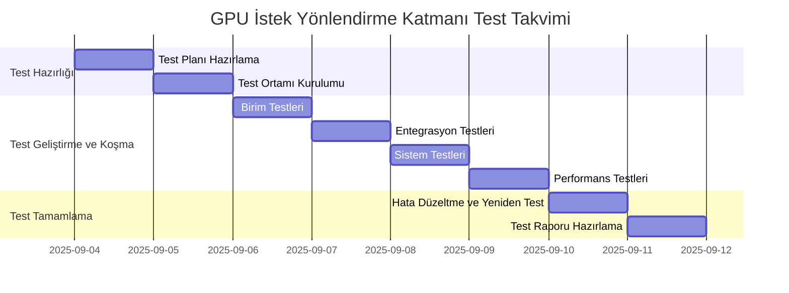

# GPU İstek Yönlendirme Katmanı Test Planı

**Doküman Bilgileri:**
- **Oluşturan:** Yazılım Mimarı, Kıdemli Backend Geliştirici, QA Mühendisi
- **Oluşturma Tarihi:** 2025-08-22
- **Son Güncelleme:** 2025-08-22
- **Durum:** Taslak
- **İlgili Görev:** KM-2.2 (GPU İstek Yönlendirme Katmanı)
- **Öncelik:** P1

## 1. Giriş

Bu belge, GPU İstek Yönlendirme Katmanı için test planını içermektedir. Bu test planı, GPU İstek Yönlendirme Katmanı'nın fonksiyonel doğruluğunu, performansını ve güvenilirliğini doğrulamak amacıyla hazırlanmıştır.

## 2. Test Kapsamı

### 2.1 Test Edilecek Bileşenler

1. **İstek Alıcı (Request Receiver)**
2. **Öncelik Yöneticisi (Priority Manager)**
3. **Kaynak Tahmin Edici (Resource Estimator)**
4. **Yük Dengeleyici (Load Balancer)**
5. **GPU Durum İzleyici (GPU State Monitor)**
6. **İstek Yönlendirici (Request Router)**
7. **Hata İşleyici (Error Handler)**
8. **Metrik Toplayıcı (Metric Collector)**

### 2.2 Test Edilmeyecek Bileşenler

1. **GPU Monitoring System**: Bu sistem, GPU İstek Yönlendirme Katmanı'nın bir parçası değildir, ancak entegrasyon testleri kapsamında test edilecektir.
2. **AI Orchestrator**: Bu sistem, GPU İstek Yönlendirme Katmanı'nın bir parçası değildir, ancak entegrasyon testleri kapsamında test edilecektir.
3. **Logging and Monitoring System**: Bu sistem, GPU İstek Yönlendirme Katmanı'nın bir parçası değildir, ancak entegrasyon testleri kapsamında test edilecektir.

## 3. Test Yaklaşımı

### 3.1 Test Seviyeleri

1. **Birim Testleri**: Her bileşenin fonksiyonel doğruluğunu test etmek için birim testleri yazılacaktır.
2. **Entegrasyon Testleri**: Bileşenler arası entegrasyonu test etmek için entegrasyon testleri yazılacaktır.
3. **Sistem Testleri**: Sistemin bir bütün olarak çalışmasını test etmek için sistem testleri yazılacaktır.
4. **Performans Testleri**: Sistemin performansını test etmek için performans testleri yazılacaktır.

### 3.2 Test Ortamları

1. **Geliştirme Ortamı**: Birim testleri ve temel entegrasyon testleri için kullanılacaktır.
2. **Test Ortamı**: Kapsamlı entegrasyon testleri, sistem testleri ve performans testleri için kullanılacaktır.
3. **Üretim Benzeri Ortam**: Üretim ortamına benzer bir ortamda son doğrulama testleri yapılacaktır.

## 4. Test Senaryoları

### 4.1 Birim Test Senaryoları

#### 4.1.1 İstek Alıcı (Request Receiver) Testleri

1. **Geçerli İstek Testi**: Geçerli bir istek alındığında, istek parametrelerinin doğru şekilde işlendiğini doğrula.
2. **Geçersiz İstek Testi**: Geçersiz bir istek alındığında, uygun hata mesajının döndürüldüğünü doğrula.
3. **İstek Kimliği Oluşturma Testi**: İstek kimliğinin (request_id) doğru şekilde oluşturulduğunu doğrula.
4. **İstek Meta Verileri Ekleme Testi**: İstek meta verilerinin (kullanıcı, zaman damgası, vb.) doğru şekilde eklendiğini doğrula.

#### 4.1.2 Öncelik Yöneticisi (Priority Manager) Testleri

1. **Öncelik Belirleme Testi**: İsteklerin öncelik seviyelerinin doğru şekilde belirlendiğini doğrula.
2. **Öncelik Sıralama Testi**: Yüksek öncelikli isteklerin düşük öncelikli isteklerden önce işlendiğini doğrula.
3. **İstek Kuyruğu Yönetimi Testi**: İstek kuyruklarının doğru şekilde yönetildiğini doğrula.

#### 4.1.3 Kaynak Tahmin Edici (Resource Estimator) Testleri

1. **Bellek Tahmini Testi**: İstek türüne göre gerekli GPU bellek miktarının doğru şekilde tahmin edildiğini doğrula.
2. **İşlem Gücü Tahmini Testi**: İstek türüne göre gerekli işlem gücünün doğru şekilde tahmin edildiğini doğrula.
3. **İşlem Süresi Tahmini Testi**: İstek türüne göre tahmini işlem süresinin doğru şekilde hesaplandığını doğrula.

#### 4.1.4 Yük Dengeleyici (Load Balancer) Testleri

1. **GPU Seçim Testi**: İstek gereksinimlerine ve GPU durumlarına göre en uygun GPU'nun doğru şekilde seçildiğini doğrula.
2. **Yük Dengeleme Stratejisi Testi**: Yük dengeleme stratejilerinin doğru şekilde uygulandığını doğrula.
3. **GPU Uygunluk Kontrolü Testi**: GPU'ların uygunluğunun doğru şekilde kontrol edildiğini doğrula.

#### 4.1.5 GPU Durum İzleyici (GPU State Monitor) Testleri

1. **GPU Durumu Alma Testi**: GPU'ların durumunun doğru şekilde alındığını doğrula.
2. **GPU Durumu Güncelleme Testi**: GPU durumlarının doğru şekilde güncellendiğini doğrula.
3. **GPU Sağlık Kontrolü Testi**: GPU'ların sağlık durumunun doğru şekilde kontrol edildiğini doğrula.

#### 4.1.6 İstek Yönlendirici (Request Router) Testleri

1. **İstek Yönlendirme Testi**: İsteklerin uygun GPU'lara doğru şekilde yönlendirildiğini doğrula.
2. **İstek Durumu İzleme Testi**: İstek durumunun doğru şekilde izlendiğini doğrula.
3. **İstek Sonuçları Toplama Testi**: İstek sonuçlarının doğru şekilde toplandığını ve döndürüldüğünü doğrula.

#### 4.1.7 Hata İşleyici (Error Handler) Testleri

1. **GPU Çökmesi Testi**: GPU çökmesi durumunda isteklerin doğru şekilde yeniden yönlendirildiğini doğrula.
2. **İstek Zaman Aşımı Testi**: İstek zaman aşımı durumunda gerekli aksiyonların doğru şekilde alındığını doğrula.
3. **Hata Loglama Testi**: Hata durumlarının doğru şekilde loglandığını ve raporlandığını doğrula.

#### 4.1.8 Metrik Toplayıcı (Metric Collector) Testleri

1. **GPU Kullanım Metrikleri Testi**: GPU kullanım oranlarının doğru şekilde toplandığını doğrula.
2. **İstek Metrikleri Testi**: İstek sayısı ve yanıt sürelerinin doğru şekilde ölçüldüğünü doğrula.
3. **Hata Oranları Testi**: Hata oranlarının doğru şekilde izlendiğini doğrula.

### 4.2 Entegrasyon Test Senaryoları

1. **İstek Alıcı - Öncelik Yöneticisi Entegrasyonu**: İstek Alıcı'nın istekleri Öncelik Yöneticisi'ne doğru şekilde ilettiğini doğrula.
2. **Öncelik Yöneticisi - Kaynak Tahmin Edici Entegrasyonu**: Öncelik Yöneticisi'nin istekleri Kaynak Tahmin Edici'ye doğru şekilde ilettiğini doğrula.
3. **Kaynak Tahmin Edici - Yük Dengeleyici Entegrasyonu**: Kaynak Tahmin Edici'nin tahmin edilen kaynak gereksinimlerini Yük Dengeleyici'ye doğru şekilde ilettiğini doğrula.
4. **Yük Dengeleyici - GPU Durum İzleyici Entegrasyonu**: Yük Dengeleyici'nin GPU Durum İzleyici'den GPU durumlarını doğru şekilde aldığını doğrula.
5. **Yük Dengeleyici - İstek Yönlendirici Entegrasyonu**: Yük Dengeleyici'nin seçilen GPU'yu İstek Yönlendirici'ye doğru şekilde ilettiğini doğrula.
6. **İstek Yönlendirici - Hata İşleyici Entegrasyonu**: İstek Yönlendirici'nin hata durumlarını Hata İşleyici'ye doğru şekilde ilettiğini doğrula.
7. **Hata İşleyici - Metrik Toplayıcı Entegrasyonu**: Hata İşleyici'nin hata durumlarını Metrik Toplayıcı'ya doğru şekilde ilettiğini doğrula.
8. **GPU İstek Yönlendirme Katmanı - GPU Monitoring System Entegrasyonu**: GPU İstek Yönlendirme Katmanı'nın GPU Monitoring System ile doğru şekilde entegre olduğunu doğrula.
9. **GPU İstek Yönlendirme Katmanı - AI Orchestrator Entegrasyonu**: GPU İstek Yönlendirme Katmanı'nın AI Orchestrator ile doğru şekilde entegre olduğunu doğrula.
10. **GPU İstek Yönlendirme Katmanı - Logging and Monitoring System Entegrasyonu**: GPU İstek Yönlendirme Katmanı'nın Logging and Monitoring System ile doğru şekilde entegre olduğunu doğrula.

### 4.3 Sistem Test Senaryoları

1. **Uçtan Uca İstek İşleme Testi**: Bir isteğin uçtan uca işlenmesini test et.
2. **Çoklu İstek İşleme Testi**: Birden fazla isteğin aynı anda işlenmesini test et.
3. **Yüksek Öncelikli İstek Testi**: Yüksek öncelikli bir isteğin düşük öncelikli isteklerden önce işlenmesini test et.
4. **GPU Çökmesi Senaryosu Testi**: Bir GPU'nun çökmesi durumunda sistemin davranışını test et.
5. **İstek Zaman Aşımı Senaryosu Testi**: Bir isteğin zaman aşımına uğraması durumunda sistemin davranışını test et.
6. **Kaynak Yetersizliği Senaryosu Testi**: GPU kaynaklarının yetersiz olması durumunda sistemin davranışını test et.
7. **Sistem Yeniden Başlatma Testi**: Sistemin yeniden başlatılması durumunda veri kaybı olmadığını ve işlemlerin kaldığı yerden devam ettiğini test et.

### 4.4 Performans Test Senaryoları

1. **Yük Testi**: Sistemin yüksek yük altında performansını test et.
2. **Stres Testi**: Sistemin maksimum kapasitesinin üzerinde yük altında davranışını test et.
3. **Dayanıklılık Testi**: Sistemin uzun süre çalışması durumunda performansını test et.
4. **Ölçeklenebilirlik Testi**: Sistemin artan GPU sayısı ile ölçeklenebilirliğini test et.
5. **Yanıt Süresi Testi**: Sistemin yanıt sürelerini test et ve SLA gereksinimlerini karşıladığını doğrula.
6. **Kaynak Kullanımı Testi**: Sistemin CPU, bellek ve disk kullanımını test et.

## 5. Test Ortamı Gereksinimleri

### 5.1 Donanım Gereksinimleri

1. **Test Sunucuları**: En az 2 adet test sunucusu (1 adet uygulama sunucusu, 1 adet veritabanı sunucusu)
2. **GPU'lar**: En az 2 adet NVIDIA GPU (farklı modeller tercih edilir)
3. **Ağ Ekipmanları**: Gigabit Ethernet bağlantısı

### 5.2 Yazılım Gereksinimleri

1. **İşletim Sistemi**: Ubuntu 20.04 LTS veya üzeri
2. **CUDA Toolkit**: CUDA 11.0 veya üzeri
3. **Docker**: Docker 20.10 veya üzeri
4. **Kubernetes**: Kubernetes 1.20 veya üzeri (opsiyonel)
5. **Python**: Python 3.8 veya üzeri
6. **Test Araçları**: pytest, locust, prometheus, grafana

### 5.3 Test Verileri

1. **Test İstekleri**: Farklı türlerde ve önceliklerde test istekleri
2. **Test Modelleri**: Farklı boyutlarda ve gereksinimlerde test modelleri
3. **Test Kullanıcıları**: Farklı kota limitlerine sahip test kullanıcıları

## 6. Test Takvimi

### 6.1 Test Aşamaları ve Süreler

1. **Test Planı Hazırlama**: 1 gün
2. **Test Ortamı Kurulumu**: 1 gün
3. **Birim Testleri Geliştirme ve Koşma**: 1 gün
4. **Entegrasyon Testleri Geliştirme ve Koşma**: 1 gün
5. **Sistem Testleri Geliştirme ve Koşma**: 1 gün
6. **Performans Testleri Geliştirme ve Koşma**: 1 gün
7. **Hata Düzeltme ve Yeniden Test**: 1 gün
8. **Test Raporu Hazırlama**: 1 gün

### 6.2 Test Takvimi

## 7. Test Çıktıları

1. **Test Planı**: Bu belge
2. **Test Senaryoları**: Detaylı test senaryoları ve test adımları
3. **Test Kodları**: Birim testleri, entegrasyon testleri, sistem testleri ve performans testleri için test kodları
4. **Test Sonuçları**: Test koşumlarının sonuçları ve hata raporları
5. **Test Raporu**: Test sonuçlarının özeti ve değerlendirmesi

## 8. Test Ekibi ve Sorumluluklar

1. **QA Mühendisi**: Test planı hazırlama, test senaryoları geliştirme, test koşumları, test raporu hazırlama
2. **Yazılım Mimarı**: Test ortamı kurulumu, entegrasyon testleri, sistem testleri
3. **Kıdemli Backend Geliştirici**: Birim testleri, hata düzeltme
4. **DevOps Mühendisi**: Test ortamı kurulumu, performans testleri

## 9. Riskler ve Azaltma Stratejileri

1. **Test Ortamı Yetersizliği**: Test ortamında yeterli sayıda ve çeşitlilikte GPU bulunmaması durumunda, GPU simülatörleri kullanılabilir.
2. **Test Süresi Yetersizliği**: Test süresinin yetersiz olması durumunda, öncelikli test senaryoları belirlenerek, önce bu senaryolar test edilebilir.
3. **Entegrasyon Sorunları**: Entegrasyon sorunları yaşanması durumunda, mock servisler kullanılarak testler yapılabilir.
4. **Performans Sorunları**: Performans sorunları yaşanması durumunda, darboğazlar tespit edilerek, optimizasyon çalışmaları yapılabilir.

## 10. Kabul Kriterleri

1. **Fonksiyonel Doğruluk**: Tüm birim testleri, entegrasyon testleri ve sistem testleri başarıyla geçilmelidir.
2. **Performans**: Performans testleri, belirlenen SLA gereksinimlerini karşılamalıdır.
3. **Güvenilirlik**: Sistem, hata durumlarında beklendiği gibi davranmalı ve veri kaybı yaşanmamalıdır.
4. **Ölçeklenebilirlik**: Sistem, artan GPU sayısı ile ölçeklenebilir olmalıdır.
5. **Dokümantasyon**: Tüm test dokümanları eksiksiz ve güncel olmalıdır.
