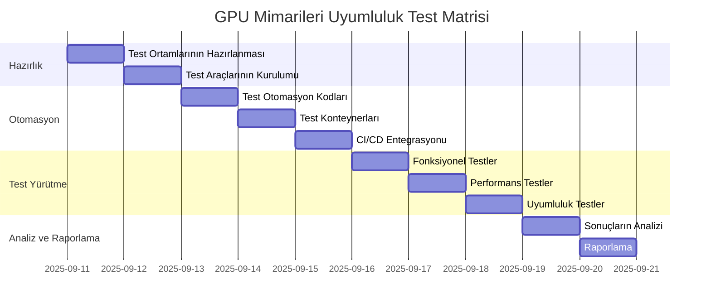

# GPU Mimarileri Uyumluluk Test Matrisi

**Doküman Bilgileri:**
- **Oluşturan:** QA Mühendisi, DevOps Mühendisi
- **Oluşturma Tarihi:** 2025-09-11
- **Son Güncelleme:** 2025-09-19
- **Durum:** Tamamlandı
- **İlgili Görev:** KM-2.3 (GPU Mimarileri Uyumluluk Test Matrisi)
- **Öncelik:** P1
- **Not:** Test yürütme, analiz ve raporlama aşamaları tamamlandı. Test sonuçları analiz edildi, performans karşılaştırmaları yapıldı ve test raporu hazırlandı. Detaylı rapor için bkz: [GPU Mimarileri Uyumluluk Test Raporu](/Yonetici_Ofisi/Calisma_Dosyalari/gpu_mimarileri_uyumluluk_test_raporu.md)

## 1. Giriş

Bu belge, ALT_LAS projesinin farklı GPU mimarileri üzerindeki uyumluluğunu test etmek için kullanılacak test matrisini ve otomasyon stratejisini içermektedir. Bu test matrisi, ALT_LAS'ın farklı NVIDIA GPU mimarileri üzerinde doğru ve verimli çalışmasını sağlamak amacıyla oluşturulmuştur.

### 1.1 Amaç

Bu test matrisinin amacı:

1. ALT_LAS'ın desteklenen tüm GPU mimarileri üzerinde doğru çalıştığını doğrulamak
2. Her GPU mimarisi için performans metriklerini ölçmek ve karşılaştırmak
3. GPU mimarileri arasındaki uyumluluk sorunlarını tespit etmek
4. Farklı GPU mimarileri için optimizasyon önerileri sunmak
5. Sürekli entegrasyon (CI) sürecine entegre edilebilecek otomasyon testleri oluşturmak

### 1.2 Kapsam

Bu test matrisi, aşağıdaki GPU mimarilerini kapsamaktadır:

1. **Ampere Mimarisi:** NVIDIA A100, NVIDIA A40, NVIDIA A10, NVIDIA RTX 3090, NVIDIA RTX 3080
2. **Turing Mimarisi:** NVIDIA T4, NVIDIA RTX 2080 Ti, NVIDIA RTX 2080
3. **Volta Mimarisi:** NVIDIA V100
4. **Pascal Mimarisi:** NVIDIA P100, NVIDIA GTX 1080 Ti
5. **Hopper Mimarisi:** NVIDIA H100 (yeni nesil)

### 1.3 Hedef Kitle

Bu belge, aşağıdaki paydaşlar için hazırlanmıştır:

1. **QA Mühendisleri:** Test planlaması ve yürütmesi için
2. **DevOps Mühendisleri:** Test otomasyonu ve CI/CD entegrasyonu için
3. **Backend Geliştiricileri:** GPU uyumluluk sorunlarını gidermek için
4. **Yazılım Mimarları:** Mimari kararlar ve optimizasyonlar için
5. **Proje Yöneticileri:** İlerleme ve risk değerlendirmesi için

## 2. Test Ortamı

### 2.1 Donanım Gereksinimleri

| GPU Mimarisi | Test Edilecek GPU Modelleri | Minimum VRAM | Minimum Sürücü Sürümü |
|--------------|------------------------------|--------------|------------------------|
| Ampere       | A100, RTX 3090, RTX 3080    | 10 GB        | NVIDIA 460.x veya üzeri |
| Turing       | T4, RTX 2080 Ti             | 8 GB         | NVIDIA 418.x veya üzeri |
| Volta        | V100                        | 16 GB        | NVIDIA 410.x veya üzeri |
| Pascal       | P100, GTX 1080 Ti           | 8 GB         | NVIDIA 384.x veya üzeri |
| Hopper       | H100                        | 80 GB        | NVIDIA 525.x veya üzeri |

### 2.2 Yazılım Gereksinimleri

| Bileşen           | Sürüm                   | Notlar                                      |
|-------------------|-------------------------|---------------------------------------------|
| İşletim Sistemi   | Ubuntu 20.04 LTS        | Minimum gereksinim                          |
| CUDA Toolkit      | CUDA 11.4 veya üzeri    | Tüm mimariler için uyumluluk                |
| cuDNN             | cuDNN 8.2 veya üzeri    | Derin öğrenme modelleri için                |
| TensorRT          | TensorRT 8.0 veya üzeri | Model optimizasyonu için                    |
| Docker            | Docker 20.10 veya üzeri | Konteynerleştirme için                      |
| NVIDIA Container Toolkit | 1.7.0 veya üzeri | GPU konteyner desteği için                  |
| Python            | Python 3.8 veya üzeri   | Test otomasyonu için                        |
| PyTorch           | PyTorch 1.9 veya üzeri  | Derin öğrenme modelleri için                |
| TensorFlow        | TensorFlow 2.6 veya üzeri | Derin öğrenme modelleri için              |

### 2.3 Test Ortamı Kurulumu

Test ortamı, aşağıdaki yöntemlerle kurulacaktır:

1. **Fiziksel GPU'lar:** Mevcut GPU'lar kullanılarak test ortamı kurulacak
2. **Bulut GPU'lar:** AWS, GCP veya Azure üzerinde GPU instansları kullanılarak test ortamı kurulacak
3. **NVIDIA GPU Cloud (NGC):** NGC konteynerları kullanılarak test ortamı kurulacak

Her test ortamı için aşağıdaki adımlar izlenecektir:

1. İşletim sistemi kurulumu ve güncellenmesi
2. NVIDIA sürücülerinin kurulumu
3. CUDA Toolkit, cuDNN ve TensorRT kurulumu
4. Docker ve NVIDIA Container Toolkit kurulumu
5. ALT_LAS Docker imajlarının oluşturulması veya çekilmesi
6. Test araçlarının kurulumu

## 3. Test Matrisi

### 3.1 Fonksiyonel Testler

| Test ID | Test Adı | Açıklama | GPU Mimarileri | Öncelik |
|---------|----------|----------|----------------|---------|
| FT-01   | Temel İşlevsellik | ALT_LAS'ın temel işlevlerinin çalışıp çalışmadığını kontrol et | Tüm mimariler | P0 |
| FT-02   | Model Yükleme | Farklı boyutlardaki modellerin yüklenip yüklenemediğini kontrol et | Tüm mimariler | P0 |
| FT-03   | Çıkarım (Inference) | Çıkarım işlemlerinin doğru sonuçlar üretip üretmediğini kontrol et | Tüm mimariler | P0 |
| FT-04   | Eğitim (Training) | Eğitim işlemlerinin doğru şekilde çalışıp çalışmadığını kontrol et | Tüm mimariler | P1 |
| FT-05   | İnce Ayar (Fine-tuning) | İnce ayar işlemlerinin doğru şekilde çalışıp çalışmadığını kontrol et | Tüm mimariler | P1 |
| FT-06   | Çoklu GPU Desteği | Çoklu GPU kullanımının doğru şekilde çalışıp çalışmadığını kontrol et | Ampere, Volta, Hopper | P1 |
| FT-07   | GPU İstek Yönlendirme | GPU İstek Yönlendirme Katmanı'nın doğru şekilde çalışıp çalışmadığını kontrol et | Tüm mimariler | P0 |
| FT-08   | Bellek Yönetimi | Bellek yönetiminin doğru şekilde çalışıp çalışmadığını kontrol et | Tüm mimariler | P0 |
| FT-09   | Hata Toleransı | Hata durumlarında sistemin doğru şekilde davranıp davranmadığını kontrol et | Tüm mimariler | P1 |
| FT-10   | Ölçeklenebilirlik | Sistemin yüksek yük altında ölçeklenebilirliğini kontrol et | Ampere, Volta, Hopper | P1 |

### 3.2 Performans Testleri

| Test ID | Test Adı | Açıklama | GPU Mimarileri | Öncelik |
|---------|----------|----------|----------------|---------|
| PT-01   | Çıkarım Hızı | Farklı model boyutları için çıkarım hızını ölç | Tüm mimariler | P0 |
| PT-02   | Çıkarım Gecikmesi | Farklı model boyutları için çıkarım gecikmesini ölç | Tüm mimariler | P0 |
| PT-03   | Eğitim Hızı | Farklı model boyutları için eğitim hızını ölç | Tüm mimariler | P1 |
| PT-04   | Bellek Kullanımı | Farklı işlemler için bellek kullanımını ölç | Tüm mimariler | P0 |
| PT-05   | GPU Kullanımı | Farklı işlemler için GPU kullanım oranını ölç | Tüm mimariler | P0 |
| PT-06   | Güç Tüketimi | Farklı işlemler için güç tüketimini ölç | Tüm mimariler | P2 |
| PT-07   | Ölçeklenebilirlik | Çoklu GPU kullanımında ölçeklenebilirlik faktörünü ölç | Ampere, Volta, Hopper | P1 |
| PT-08   | Yük Testi | Yüksek yük altında performansı ölç | Tüm mimariler | P1 |
| PT-09   | Dayanıklılık Testi | Uzun süreli çalışmada performans değişimini ölç | Tüm mimariler | P2 |
| PT-10   | TensorRT Optimizasyonu | TensorRT optimizasyonu ile performans artışını ölç | Tüm mimariler | P1 |

### 3.3 Uyumluluk Testleri

| Test ID | Test Adı | Açıklama | GPU Mimarileri | Öncelik |
|---------|----------|----------|----------------|---------|
| CT-01   | CUDA Sürüm Uyumluluğu | Farklı CUDA sürümleri ile uyumluluğu kontrol et | Tüm mimariler | P0 |
| CT-02   | cuDNN Sürüm Uyumluluğu | Farklı cuDNN sürümleri ile uyumluluğu kontrol et | Tüm mimariler | P1 |
| CT-03   | TensorRT Sürüm Uyumluluğu | Farklı TensorRT sürümleri ile uyumluluğu kontrol et | Tüm mimariler | P1 |
| CT-04   | Sürücü Sürüm Uyumluluğu | Farklı NVIDIA sürücü sürümleri ile uyumluluğu kontrol et | Tüm mimariler | P0 |
| CT-05   | İşletim Sistemi Uyumluluğu | Farklı işletim sistemleri ile uyumluluğu kontrol et | Tüm mimariler | P1 |
| CT-06   | Konteyner Uyumluluğu | Docker ve Kubernetes ortamlarında uyumluluğu kontrol et | Tüm mimariler | P0 |
| CT-07   | Mimari Özellik Uyumluluğu | Mimariye özgü özelliklerin (Tensor Core, vb.) uyumluluğunu kontrol et | Ampere, Turing, Volta, Hopper | P1 |
| CT-08   | Bellek Boyutu Uyumluluğu | Farklı bellek boyutlarına sahip GPU'lar ile uyumluluğu kontrol et | Tüm mimariler | P0 |
| CT-09   | Çoklu GPU Uyumluluğu | Farklı mimarilere sahip GPU'ların birlikte kullanımını kontrol et | Tüm mimariler | P2 |
| CT-10   | Bulut Sağlayıcı Uyumluluğu | Farklı bulut sağlayıcılarındaki GPU'lar ile uyumluluğu kontrol et | Tüm mimariler | P2 |

## 4. Test Otomasyonu

### 4.1 Otomasyon Stratejisi

Test otomasyonu, aşağıdaki stratejiler kullanılarak gerçekleştirilecektir:

1. **Birim Testleri:** GPU bağımlı bileşenlerin birim testleri
2. **Entegrasyon Testleri:** GPU bağımlı bileşenlerin entegrasyon testleri
3. **Uçtan Uca Testleri:** Tam sistem testleri
4. **Performans Testleri:** Performans ölçüm ve karşılaştırma testleri
5. **Uyumluluk Testleri:** Farklı GPU mimarileri ve yazılım sürümleri ile uyumluluk testleri

### 4.2 Otomasyon Araçları

Test otomasyonu için aşağıdaki araçlar kullanılacaktır:

1. **pytest:** Birim ve entegrasyon testleri için
2. **pytest-benchmark:** Performans testleri için
3. **locust:** Yük testleri için
4. **Docker:** Test ortamlarının konteynerleştirilmesi için
5. **Kubernetes:** Test ortamlarının orkestrasyon için
6. **Jenkins:** CI/CD entegrasyonu için
7. **Prometheus:** Metrik toplama için
8. **Grafana:** Metrik görselleştirme için
9. **NVIDIA DCGM:** GPU metriklerinin toplanması için
10. **NVIDIA Nsight Systems:** Performans profilleme için

### 4.3 Otomasyon Mimarisi

Test otomasyonu, aşağıdaki mimari kullanılarak gerçekleştirilecektir:

1. **Test Konteynerları:** Her GPU mimarisi için test konteynerları oluşturulacak
2. **Test Orchestrator:** Test konteynerlarını yönetecek ve test sonuçlarını toplayacak
3. **Metrik Toplayıcı:** GPU metriklerini toplayacak ve raporlayacak
4. **Rapor Oluşturucu:** Test sonuçlarını ve metrikleri raporlayacak
5. **CI/CD Entegrasyonu:** Jenkins veya GitHub Actions ile entegrasyon

### 4.4 Otomasyon İş Akışı

Test otomasyonu, aşağıdaki iş akışı kullanılarak gerçekleştirilecektir:

1. **Ortam Hazırlığı:** Test ortamının hazırlanması
2. **Test Konteynerlarının Oluşturulması:** Her GPU mimarisi için test konteynerlarının oluşturulması
3. **Testlerin Çalıştırılması:** Test konteynerlarında testlerin çalıştırılması
4. **Metriklerin Toplanması:** GPU metriklerinin toplanması
5. **Sonuçların Analizi:** Test sonuçlarının ve metriklerin analiz edilmesi
6. **Raporlama:** Test sonuçlarının ve metriklerin raporlanması

## 5. Test Senaryoları

### 5.1 Temel İşlevsellik Testleri

1. **FT-01-01:** ALT_LAS'ın başlatılması ve temel API'lerin çalışması
2. **FT-01-02:** GPU algılama ve listeleme
3. **FT-01-03:** GPU seçimi ve atama

### 5.2 Model Yükleme Testleri

1. **FT-02-01:** Küçük model yükleme (< 1 GB)
2. **FT-02-02:** Orta boy model yükleme (1-5 GB)
3. **FT-02-03:** Büyük model yükleme (> 5 GB)

### 5.3 Çıkarım Testleri

1. **FT-03-01:** Tekli çıkarım
2. **FT-03-02:** Batch çıkarım
3. **FT-03-03:** Streaming çıkarım

### 5.4 Performans Testleri

1. **PT-01-01:** Küçük model çıkarım hızı
2. **PT-01-02:** Orta boy model çıkarım hızı
3. **PT-01-03:** Büyük model çıkarım hızı

### 5.5 Uyumluluk Testleri

1. **CT-01-01:** CUDA 11.0 ile uyumluluk
2. **CT-01-02:** CUDA 11.4 ile uyumluluk
3. **CT-01-03:** CUDA 11.8 ile uyumluluk

## 6. Test Planı

### 6.1 Test Aşamaları

Test çalışması, aşağıdaki aşamalarda gerçekleştirilecektir:

1. **Hazırlık Aşaması (2 gün):**
   - Test ortamlarının hazırlanması
   - Test araçlarının kurulumu
   - Test senaryolarının detaylandırılması

2. **Otomasyon Geliştirme Aşaması (3 gün):**
   - Test otomasyon kodlarının geliştirilmesi
   - Test konteynerlarının oluşturulması
   - CI/CD entegrasyonunun yapılması

3. **Test Yürütme Aşaması (3 gün):**
   - Fonksiyonel testlerin yürütülmesi
   - Performans testlerinin yürütülmesi
   - Uyumluluk testlerinin yürütülmesi

4. **Analiz ve Raporlama Aşaması (2 gün):**
   - Test sonuçlarının analiz edilmesi
   - Performans karşılaştırmalarının yapılması
   - Test raporunun hazırlanması

### 6.2 Test Takvimi

## 7. Beklenen Çıktılar

Bu test çalışmasının sonucunda aşağıdaki çıktılar elde edilecektir:

1. **GPU Mimarileri Uyumluluk Matrisi:** Hangi GPU mimarilerinin hangi özelliklerle uyumlu olduğunu gösteren matris
2. **Performans Karşılaştırma Raporu:** Farklı GPU mimarileri arasındaki performans karşılaştırması
3. **Uyumluluk Sorunları Raporu:** Tespit edilen uyumluluk sorunları ve çözüm önerileri
4. **Optimizasyon Önerileri:** Her GPU mimarisi için optimizasyon önerileri
5. **Test Otomasyon Kodu:** Sürekli entegrasyon sürecine entegre edilebilecek test otomasyon kodu
6. **Test Konteynerları:** Her GPU mimarisi için test konteynerları

## 8. Riskler ve Azaltma Stratejileri

| Risk ID | Risk Açıklaması | Olasılık | Etki | Azaltma Stratejisi |
|---------|-----------------|----------|------|---------------------|
| R-01    | Bazı GPU mimarilerine erişim sağlanamaması | Orta | Yüksek | Bulut sağlayıcılar üzerinden GPU instansları kullanmak |
| R-02    | Test ortamlarının kurulumunda sorunlar yaşanması | Düşük | Orta | Docker konteynerları ve yapılandırma yönetimi araçları kullanmak |
| R-03    | Performans testlerinin tutarsız sonuçlar vermesi | Orta | Orta | Test koşullarını standartlaştırmak ve çoklu test koşumu yapmak |
| R-04    | Otomasyon kodlarının bazı GPU mimarileri ile uyumsuz olması | Düşük | Yüksek | Modüler ve esnek bir otomasyon mimarisi tasarlamak |
| R-05    | CI/CD entegrasyonunda sorunlar yaşanması | Düşük | Orta | CI/CD süreçlerini adım adım entegre etmek ve test etmek |

## 9. Sonuç

Bu test matrisi ve otomasyon stratejisi, ALT_LAS'ın farklı GPU mimarileri üzerindeki uyumluluğunu test etmek için kullanılacaktır. Test sonuçları, ALT_LAS'ın farklı GPU mimarileri üzerinde doğru ve verimli çalışmasını sağlamak için kullanılacaktır.
