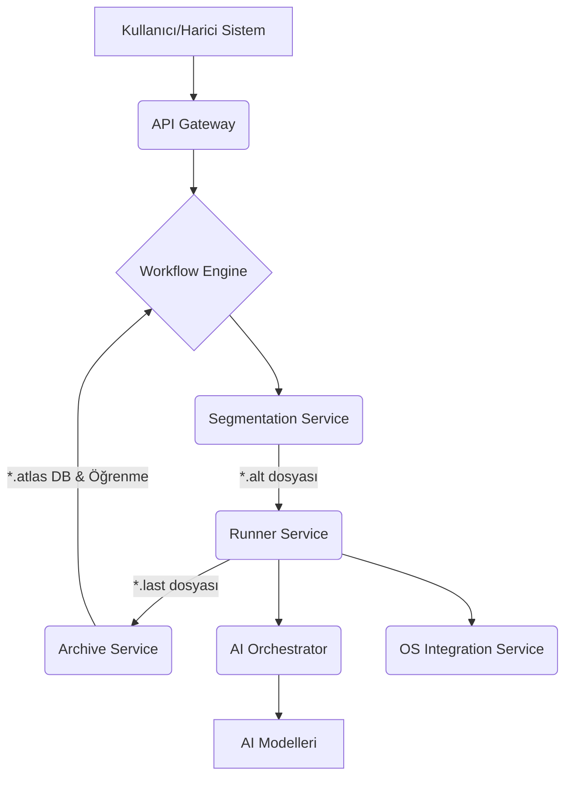

# ALT_LAS Sistem Mimarisi

## 1. Genel Bakış

ALT_LAS, bilgisayar sistemlerini yapay zeka ile yönetmek için tasarlanmış, modüler bir mikroservis mimarisi kullanan, açık kaynaklı ve ticari kullanıma uygun bir platformdur. Sistem, kullanıcı komutlarını alıp bunları işlenebilir görevlere dönüştüren, bu görevleri yürüten, sonuçları analiz eden ve öğrenme döngüleri için değerli verileri arşivleyen kapsamlı bir sistemdir.

## 2. Temel Prensipler

- **Modülerlik**: Her biri belirli bir işlevselliğe odaklanmış bağımsız servisler.
- **Ölçeklenebilirlik**: Yatay ve dikey ölçeklendirme için tasarlanmıştır.
- **Lisans Uyumluluğu**: Ticari kullanıma uygun açık kaynak lisanslar hedeflenmiştir.
- **Sürekli Öğrenme**: Başarılı ve başarısız işlemlerden öğrenerek sistemin kendini geliştirmesi amaçlanır.
- **Güvenlik**: İzolasyon, güvenli iletişim ve erişim kontrolü temel önceliklerdendir.

## 3. Dosya Tabanlı İş Akışı

ALT_LAS, üç temel dosya tipine dayalı bir iş akışı kullanır:

1.  **`*.alt`**: Görev tanımları, komut segmentleri ve yürütme parametrelerini içerir. Segmentation Service tarafından oluşturulur.
2.  **`*.last`**: Görev yürütme sonuçlarını, çıktıları, hataları, performans metriklerini ve oluşturulan artefaktları içerir. Runner Service tarafından üretilir.
3.  **`*.atlas`**: Başarılı `*.last` dosyalarından elde edilen bilgi birikimini, öğrenilmiş kalıpları ve analizleri içerir. Archive Service tarafından oluşturulur ve yönetilir.

## 4. Mimari Bileşenler ve Katmanlar

ALT_LAS, aşağıdaki ana servislerden ve katmanlardan oluşur:

### 4.1. Çekirdek Servisler (Core Services)

#### a. API Gateway (Node.js/Express)
-   **Lisans**: MIT
-   **Sorumluluklar**: Dış dünyadan gelen tüm istekler için merkezi giriş noktasıdır. Kimlik doğrulama (JWT tabanlı, token yenileme, güvenli çıkış), yetkilendirme (Rol Tabanlı Erişim Kontrolü - RBAC), istek yönlendirme (arka uç servislere ters proxy), API dokümantasyonu (Swagger/OpenAPI aracılığıyla `/api-docs`), rate limiting, yanıt önbellekleme (Redis ile), gelişmiş oturum yönetimi, performans izleme (OpenTelemetry entegrasyonu), detaylı loglama (Winston ile log rotasyonu), istek/yanıt sıkıştırma, temel güvenlik başlıkları (Helmet), CORS yönetimi ve dinamik servis keşfi (sağlık kontrolleri ile) gibi kritik görevleri yerine getirir.
-   **Teknolojiler**: Express.js, TypeScript, Swagger/OpenAPI, jsonwebtoken, bcrypt, http-proxy-middleware, ioredis, Winston, OpenTelemetry SDK, Helmet, cors, compression, Jest.

#### b. Workflow Engine (Python/FastAPI)
-   **Lisans**: MIT
-   **Sorumluluklar**: Kullanıcıların ve sistemin karmaşık iş akışları tanımlamasını, zamanlamasını, yürütmesini ve izlemesini sağlar. Farklı "parçaları" (pieces) bir araya getirerek otomasyonlar oluşturur: Tetikleyiciler (manuel, zamanlanmış, webhook), Eylemler (kod yürütme, HTTP isteği, gecikme) ve Entegrasyonlar (AI Orchestrator, OS Integration gibi diğer ALT_LAS servisleri).
-   **Teknolojiler**: FastAPI, Pydantic, Loguru.

#### c. Segmentation Service (Python/FastAPI)
-   **Lisans**: MIT
-   **Sorumluluklar**: Kullanıcıdan gelen doğal dil komutlarını veya yapılandırılmış istekleri alır, analiz eder, anlamsal olarak böler ve Runner Service veya Workflow Engine tarafından işlenebilecek görev segmentlerini içeren `*.alt` dosyalarına dönüştürür. Komut işleme davranışını özelleştirmek için **Mod** (Normal, Dream, Explore, Chaos) ve **Persona** (technical_expert, creative_writer vb.) sistemlerini destekler.
-   **Teknolojiler**: FastAPI, Pydantic, NLTK, PyYAML.

#### d. Runner Service (Rust)
-   **Lisans**: MIT/Apache 2.0
-   **Sorumluluklar**: `*.alt` dosyalarında tanımlanan görevleri asenkron olarak yürütür. Görev bağımlılıklarını yönetir, AI Orchestrator ve OS Integration Service gibi diğer servislerle etkileşime girer, görev çıktılarını toplar ve yürütme sonuçlarını, metrikleri, artefaktları ve isteğe bağlı olarak görev bağımlılık grafiği görselleştirmesi ile HTML raporlarını içeren `*.last` dosyalarını üretir.
-   **Teknolojiler**: Tokio, Actix-web, Serde, Reqwest.

#### e. Archive Service (Go)
-   **Lisans**: BSD-3-Clause
-   **Sorumluluklar**: Runner Service tarafından üretilen `*.last` dosyalarını NATS mesajlaşma sistemi üzerinden veya doğrudan API çağrılarıyla kabul eder, doğrular, PostgreSQL veritabanında kalıcı olarak saklar. Başarı oranlarını izler, düşük başarılı görevler için uyarılar üretebilir ve başarılı sonuçlardan öğrenilmiş bilgileri içeren `*.atlas` dosyaları oluşturarak sistemin genel bilgi birikimine katkıda bulunur. Saklanan sonuçlar için arama ve analiz API'leri sunar.
-   **Teknolojiler**: Go, Gin (veya Mux), NATS, PostgreSQL (GORM veya sqlx), Logrus.

### 4.2. Entegrasyon Servisleri (Integration Services)

#### a. OS Integration Service (Rust)
-   **Lisans**: MIT/Apache 2.0
-   **Sorumluluklar**: Farklı işletim sistemleriyle (Windows, macOS, Linux) düşük seviyeli etkileşimler sağlar. Dosya sistemi işlemleri (okuma, yazma, listeleme, silme), süreç yönetimi (başlatma, durdurma, izleme), sistem bilgisi toplama (CPU, RAM, disk kullanımı) ve isteğe bağlı olarak CUDA hızlandırmalı ekran görüntüsü alma gibi yetenekler sunar. Güvenli ve platform bağımsız bir arayüz sağlamayı hedefler.
-   **Teknolojiler**: Rust FFI, Platform-spesifik API'ler (örn: winapi, libc), Actix-web.

#### b. AI Orchestrator (Python/FastAPI)
-   **Lisans**: MIT
-   **Sorumluluklar**: Çeşitli yerel ve bulut tabanlı yapay zeka modellerinin (LLM'ler, görüntü işleme modelleri, ses işleme modelleri vb.) yönetimini, dağıtımını, yük dengelemesini ve kullanımını koordine eder. Runner Service ve Segmentation Service gibi diğer servislerden gelen AI görev isteklerini alır, uygun modeli seçer, görevi yürütür ve sonuçları geri döndürür.
-   **Teknolojiler**: FastAPI, Pydantic, ONNX Runtime, PyTorch, TensorFlow, Hugging Face Transformers, Docker.

### 4.3. Kullanıcı Arayüzü Katmanı (UI Layer)

-   **Desktop UI (Electron/React)**: Zengin özellikli masaüstü uygulaması.
-   **Web Dashboard (React)**: Görev izleme, analitik ve yönetim için web tabanlı arayüz.
-   **Mobile Companion (React Native)**: Mobil bildirimler ve temel kontrol için yardımcı uygulama.

### 4.4. Güvenlik Katmanı (Security Layer)

-   **Policy Enforcement**: Güvenlik politikalarını ve erişim izinlerini yönetir.
-   **Sandbox Manager**: Görevlerin ve AI modellerinin güvenli ve izole ortamlarda çalıştırılmasını sağlar.
-   **Audit Service**: Sistemdeki önemli olayları ve güvenlik günlüklerini kaydeder.

## 5. Çalışma Modları ve Persona Sistemi

Segmentation Service, komut yorumlama ve görev oluşturma sürecini etkileyen farklı çalışma modları ve personalar sunar:

### 5.1. Çalışma Modları
-   **Normal**: Standart, deterministik görev işleme.
-   **Dream**: Daha yaratıcı, varsayımsal senaryolar üretebilen mod.
-   **Explore**: Komutun kapsamını genişleten, alternatifleri araştıran mod.
-   **Chaos**: Rastgelelik ve öngörülemezlik ekleyerek sistemin sınırlarını test eden mod (`chaos_level` ile kontrol edilir).

### 5.2. Persona Sistemi
AI etkileşimlerinin tonunu ve odağını belirler:
-   `technical_expert` (Varsayılan): Teknik detaylara ve hassasiyete odaklanır.
-   `creative_writer`: Anlatı ve stilistik ifadelere odaklanır.
-   `researcher`: Bilgi toplama ve analize odaklanır.
-   `project_manager`: Görev yönetimi ve planlamaya odaklanır.

## 6. Teknoloji Yığını Özeti

| Bileşen                | Ana Teknoloji           | Lisans (Ana)     |
| ----------------------- | ----------------------- | ---------------- |
| API Gateway             | Node.js/Express, TS     | MIT              |
| Workflow Engine         | Python/FastAPI          | MIT              |
| Segmentation Service    | Python/FastAPI          | MIT              |
| Runner Service          | Rust/Tokio, Actix-web   | MIT/Apache 2.0   |
| Archive Service         | Go/Gin, NATS, PostgreSQL| BSD-3-Clause     |
| OS Integration Service  | Rust/Actix-web          | MIT/Apache 2.0   |
| AI Orchestrator         | Python/FastAPI          | MIT              |
| Desktop UI              | Electron/React          | MIT              |
| Web Dashboard           | React                   | MIT              |
| Mobile App              | React Native            | MIT              |
| Veritabanı (Archive)    | PostgreSQL              | PostgreSQL       |
| Mesajlaşma (Archive)    | NATS                    | Apache 2.0       |
| Önbellek (API Gateway)  | Redis                   | BSD              |

## 7. Veri Akışı (Örnek Senaryo)

1.  Kullanıcı, Desktop UI üzerinden "Belgelerimdeki tüm metin dosyalarını özetle ve en önemlilerini e-posta ile gönder" komutunu verir.
2.  Desktop UI, komutu API Gateway'e iletir.
3.  API Gateway, isteği doğrular ve Workflow Engine'e veya doğrudan Segmentation Service'e yönlendirir.
4.  **Segmentation Service**: Komutu alır, "Belgelerimdeki metin dosyalarını bul", "Her birini özetle (AI Orchestrator kullanarak)", "En önemlilerini belirle (AI Orchestrator kullanarak)", "E-posta oluştur" ve "E-posta gönder (OS Integration veya başka bir servis aracılığıyla)" gibi alt görevlere ayırır. Bu görevleri ve bağımlılıklarını bir `*.alt` dosyasına yazar.
5.  **Runner Service**: `*.alt` dosyasını alır.
    *   OS Integration Service'i kullanarak "Belgelerim" dizinindeki metin dosyalarını listeler.
    *   Her dosya için AI Orchestrator'dan özetleme ister.
    *   Özetlerden en önemlilerini belirlemek için tekrar AI Orchestrator'ı kullanır.
    *   E-posta içeriğini oluşturur.
    *   E-postayı göndermek için ilgili servisi (örn: OS Integration ile yerel e-posta istemcisi veya bir e-posta API servisi) çağırır.
    *   Tüm adımların sonuçlarını, başarı durumlarını ve loglarını bir `*.last` dosyasına kaydeder.
6.  **Archive Service**: Başarılı `*.last` dosyasını alır, veritabanına kaydeder ve gelecekteki analizler için `*.atlas` verilerine işler.
7.  Kullanıcıya işlem durumu ve sonucu UI üzerinden bildirilir.

## 8. Dağıtım

Tüm servisler Docker konteynerleri olarak paketlenip Docker Compose veya Kubernetes gibi bir orkestrasyon aracı ile dağıtılması hedeflenmektedir. Bu, geliştirme, test ve üretim ortamlarında tutarlılık ve kolay yönetim sağlar.

## 9. Ölçeklenebilirlik ve Performans

-   Her mikroservis bağımsız olarak ölçeklendirilebilir.
-   Kritik performans gerektiren servislerde (Runner, OS Integration) Rust ve Go gibi yüksek performanslı diller kullanılmıştır.
-   Asenkron işlemler ve mesaj kuyrukları (NATS) ile sistemin yanıt verme yeteneği artırılmıştır.

## 10. Güvenlik

-   API Gateway üzerinden merkezi kimlik doğrulama ve yetkilendirme.
-   Servisler arası iletişimde güvenli protokoller (HTTPS, mTLS) hedeflenir.
-   Hassas verilerin şifrelenmesi (hem aktarımda hem de saklamada).
-   Görevlerin ve AI modellerinin çalıştırılması için sandbox ortamları.
-   Kapsamlı denetim günlükleri.

Bu mimari, ALT_LAS platformunun esnek, ölçeklenebilir, performanslı ve güvenli bir şekilde geliştirilmesini ve çalışmasını sağlamak üzere tasarlanmıştır. Geliştirme süreci ilerledikçe detaylar daha da netleşecektir.
